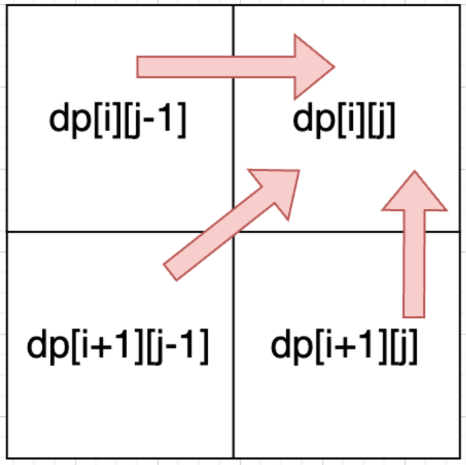

# 第四题：最长回文子序列

#### **1. DP 数组定义**

- **`dp[i][j]`**：字符串`s`在区间`[i, j]`内的最长回文子序列的长度。
  （子序列不要求连续，回文需对称，如`"bbbab"`的最长回文子序列是`"bbbb"`）

#### **2. 递推公式**

- **情况 1：`s[i] == s[j]`**
  两端字符可组成回文，中间部分`[i+1, j-1]`的最长回文子序列长度加 2：
  `dp[i][j] = dp[i+1][j-1] + 2`。
- **情况 2：`s[i] != s[j]`**
  两端字符无法同时组成回文，取左半部分`[i+1, j]`或右半部分`[i, j-1]`的最大值：
  `dp[i][j] = max(dp[i+1][j], dp[i][j-1])`。

**核心逻辑**：通过比较两端字符，决定是否扩展回文子序列。

#### **3. 初始化**

- **单个字符**：`i == j`时，`dp[i][j] = 1`（自身是回文）。
- **其他情况**：初始化为 0（递推时会被覆盖）。

| 示例初始化（`s = "bbbab"`） |        |        |        |        |        |
| --------------------------- | ------ | ------ | ------ | ------ | ------ |
|                             | 0（b） | 1（b） | 2（b） | 3（a） | 4（b） |
| **0（b）**                  | 1      |        |        |        |        |
| **1（b）**                  |        | 1      |        |        |        |
| **2（b）**                  |        |        | 1      |        |        |
| **3（a）**                  |        |        |        | 1      |        |
| **4（b）**                  |        |        |        |        | 1      |

#### **4. 遍历顺序**

- **按区间长度从小到大遍历**：从长度 1（单个字符）到长度`n`（整个字符串）。
- **方向**：`i`从大到小，`j`从小到大（保证`i+1`和`j-1`已计算）。

#### **5. 最终结果**

- 整个字符串的最长回文子序列长度为`dp[0][n-1]`。

### **附加问题：如何输出最长回文子序列？**

#### **思路：回溯 DP 数组**

从`i=0`、`j=n-1`开始，根据 DP 值反向构建子序列：

1. **若`s[i] == s[j]`**：将字符加入结果，移动`i++`、`j--`。
2. **若`s[i] != s[j]`**：比较`dp[i+1][j]`和`dp[i][j-1]`，向较大值的方向移动。
3. **处理奇数长度**：中间字符单独加入（若剩余`i == j`）。

#### **示例 1：`s = "bbbab"`**

- 回溯路径：
  `(0,4)`（`b==b`）→ 加入`b`，`i=1,j=3`
  `(1,3)`（`b!=a`）→ 比较`dp[2][3]`（1）和`dp[1][2]`（2）→ 移动`j--`到`(1,2)`
  `(1,2)`（`b==b`）→ 加入`b`，`i=2,j=1`（结束）
  结果：`"b" + "b" + reverse("b" + "b")` → `"bbbb"`。

### **关键分析**

1. **时间复杂度**：填表`O(n²)`，回溯`O(n)`，总时间`O(n²)`。
2. **空间复杂度**：DP 表`O(n²)`（可优化为`O(n)`，但回溯需要原表）。
3. 回溯逻辑：
   - 对称添加字符（`res`和`res[::-1]`）。
   - 处理奇数长度：中间字符只需添加一次（在`res`中已包含）。

### **复杂度优化（空间）**

- **滚动数组**：仅保留当前行和下一行，空间优化至`O(n)`。
  （但回溯需要完整 DP 表，故优化仅适用于仅求长度的场景。）

### **总结**

- **DP 核心**：利用区间对称性，通过两端字符是否相等决定状态转移。
- **回溯技巧**：从两端向中间移动，对称构建子序列，处理奇偶长度。
- **适用场景**：所有需要输出具体子序列的回文问题（如最长回文子序列、回文分割等）。

此方法清晰地将动态规划填表与回溯结合，既保证了时间效率，又能准确构建最长回文子序列。

# 第三题

我感觉 第一个目标是个贪心模拟。首先比较显然的是全选大教室。然后我是觉得，第一个目标不涉及换教室的场景。因为换教室一定是在存在小教室的情况下做的，而且只有一种情况。就是之前的某门课A上完了，新的一门课B发现自己不用新开房间，直接用A的教室，结果A是个大教室。然后B上了一段，又来了个C，C要用大教室，但是B可以在小教室，这个时候才会触发换教室。不然大家全是大教室，肯定都容纳的下，没有换教室的必要。
所以目标1我觉得，首先按照（开始，结束）时间的优先级升序排序，遍历，小根堆维护当前已开各教室的结束时间，每有一个新的课程到来，看堆顶，如果结束时间能衔接上现在的开始时间（top[end]<=cur[start])，则入住这个教室，（pop后更新完end时间戳然后push回去），如果不能，那么新开教室（new一个时间戳push进去），同时统计已开教室数量。

然后目标2 我认为是个二分查找，首先目标1已经计算出来最少需要多少教室了。但是我觉得统计至少需要多少间大教室作为左边界有点麻烦（也就是并行课程中，同时需要大教室的数量的最大值），所以不妨直接设左边界为0好了，不要大教室；然后右边界自然就是目标1的答案。然后二分，检查二分出来的这个大教室数量能否满足需求。
检查过程：首先还是升序排序。遍历，但我们维护两个小根堆，一个对应小教室结束时间戳，一个对应大教室。如果目前来的是人数处于小教室区间，那么检查已有的小教室能否衔接，能就pop再push置换时间戳；如果不能，检查大教室能否衔接，如果能就入住，如果不能，需要注意到我们这里要尽可能少的消耗二分出来的大教室数量，所以选择新开小教室，而不是新开大教室，以防后面有需要用大教室的课程再次消耗大教室，然后入住。如果小教室消耗殆尽，那么只能新开大教室入住。（对应的操作都是new时间戳push）
如果不得不入住大教室，那么检查大教室是否能衔接，这里置换时，如果数据量不大，我觉得直接暴力查看所有已有大教室，在所有能衔接的教室中，选择本应去小教室的课程置换（也就是我目标1说的那个场景），如果实在不能置换，开新的大教室。
如果开的新大教室过多，超过二分出来的数量，false，把左边界改大；否则改小右边界。

选择本应去小教室的课程置换（也就是我目标1说的那个场景）这句话说的有点笼统，具体操作上，我感觉应该是让小教室去查看小教室小根堆，如果有能置换的那么置换；如果没有，且此时小教室数量未消耗殆尽，那么新开小教室入住，且新来的这个大教室课程入住小教室课程换教室后留下的大教室；否则，只能新开大教室入住了。

这里单调性也比较好说明，肯定是越多大教室越有可能在总量一定的情况下容纳下所有课程的。这里我觉得这个目标2，直接求解很困难，只能想办法转为判定问题，又恰好有单调性，所以可以二分。

# 第五题

染色：就是遍历

p和q公共祖先：由于题目给了父节点，就直接从p一直染色到root，其中路径上的节点都要保存染色之前的颜色。然后q再一直染色到root，直到遇到了p到root路径上的节点，然后从该节点到root开始恢复为染色之前的颜色。