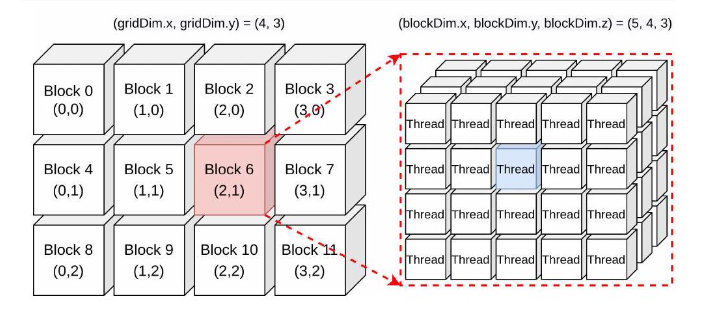

# CUDA

它通过扩展 C/C++ 语言，允许开发者利用 NVIDIA GPU 的并行处理能力加速计算密集型任务.

# GPU结构

每个网格包含多个线程块，每个线程块包含多个线程，同一块中的几个线程组成一个warp。

每个线程块用一个流多处理器SM控制。

# 本原根

在数论变换（NTT）里，本原根是有限域中的一个关键元素。对于模 q 和正整数 n，若一个数 $\omega$满足 $\omega^n\equiv1\pmod{q}$，且对于所有小于 n 的正整数 k，都有$\omega^k\not\equiv1\pmod{q}$，则称 $\omega$ 是模 q 意义下的 n 次本原根。

# NTT

NTT（数论变换）是快速傅里叶变换（FFT）的有限域版本，用于高效计算多项式乘法。它通过选择模 q 和本原根 $\omega$，将多项式乘法从$ O(N^2)$降到 $O(N \log N)$。核心是蝴蝶操作，每次处理两个元素并利用模运算保持结果在有限域内。广泛应用于同态加密（如 BFV 方案）、后量子密码等领域，且易于并行加速（如 GPU 实现）。

# 蝴蝶操作

蝴蝶操作是数论变换（NTT）里的核心步骤，源自快速傅里叶变换（FFT）。它把大的 NTT 问题拆成小问题，每次处理两个元素。对于元素$ x_i $和$ x_j$，用本原根 $\omega$做运算，正向 NTT 时算 $x_i + \omega \cdot x_j $和 $x_i - \omega \cdot x_j$并替换原元素，运算都在模 q 意义下进行。它能让 NTT 复杂度从$ O(N^2)$降到 $O(N \log N)$，还适合并行计算。

# 线程分配

使用`threadIdx.x`作为局部线程 ID，通过循环将数据从全局内存复制到共享内存。这里每个线程负责一个特定的数据元素的操作，即`local_tid`对应的数据。在 NTT 迭代中，根据当前序列长度 `length` 计算步长 `step`，再通过线程 ID（`local_tid`）计算目标数据索引和旋转因子索引，确保每个线程明确处理特定的数据元素与旋转因子。

# 多内核单内核中的内核

指的是 **在 GPU 上并行执行的函数**，它与 GPU 的硬件架构紧密配合实现计算。

- **从编程角度**：内核函数通过 `__global__` 关键字声明（如代码中的 `CTBasedNTTInnerSingle` `GSBasedINTTInnerSingle`），由主机发起调用，在 GPU 上以并行线程的形式执行。
- **对应 GPU 硬件：**
  - GPU 包含多个 **流多处理器（Stream Multiprocessor，SM）**，每个 SM 又包含多个 **CUDA 核心（计算单元）**。
  - 内核函数启动时，会将任务划分为多个线程块（Block），**每个线程块被分配到一个 SM 上**。SM 负责调度线程块内的线程，让它们在其包含的 CUDA 核心上并行执行计算。

# 单内核多内核

### 一、单核方法

- 单内核方法通过单个内核函数调用来完成整个计算任务。在这种方法中，一个或多个线程块被组织起来处理任务。例如在 NTT（数论变换）计算中，一个包含 1024 个线程的 GPU 块可能被用来处理数组 a 的 2048 个元素。
- **线程块内线程协作**：线程块内的线程通过共享内存进行高效的数据交互和同步。在 NTT 的例子里，线程会将全局内存的数据复制到共享内存，然后在共享内存中进行蝴蝶操作等计算，最后再将结果写回全局内存。
- **线程块与 SM 映射**：这些线程块会被分配到 GPU 的流多处理器（SM）上执行。每个 SM 负责调度和管理线程块内的线程，线程被划分为线程束（通常 32 个线程为一个线程束），由 SM 的线程调度器分配到 CUDA 核心上执行。

### 二、多核方法

- 多内核方法通过多次内核函数调用来完成计算任务。每次内核调用会调度多个 GPU 块，这些块会同时运行，从而实现更高程度的并行计算。
- **多次内核调用**：每次内核调用时，CUDA 运行时系统会将线程块分配到不同的 SM 上。每个 SM 独立地调度和执行分配给它的线程块，不同内核调用之间的线程块也可以并行执行。
- **资源利用**：多内核方法可以充分利用 GPU 多个 SM 的计算资源，让更多的线程块同时执行，从而加速计算过程。

# 混合方法中，判断 NTT 块大小的阈值是如何确定的？切换多内核和单内核模式时，如何保证数据一致性和计算正确性？

- **阈值确定**：通过实验确定切换点（如 61 位设计中，当块大小为 2048 时切换），平衡内核调用开销与并行效率。
- **数据同步**：多核模式下，每个内核调用独立处理不同块；单核模式下，使用共享内存确保数据一致性，避免同步开销。
- **优势**：混合方法在大多项式（如 n=32768）中减少了内核调用次数（从 log₂(n) 次降至 1 次），提升了 30-60% 的性能（表 5）。

# 项目中如何评估 GPU 加速后的 NTT 算法效率？具体对比了哪些指标，比如计算时间、吞吐量，和 CPU 版本或其他 GPU 实现相比效果如何？

- **加速比**：在 Tesla V100 上，BFV 的密钥生成、加密和解密分别提升 141.95x、105.17x 和 90.13x（表 7）。
- **对比基准**：与 SEAL 库（CPU）相比，NTT/INTT 性能提升显著（如 32768 点 NTT 在 V100 上仅需 39μs，表 6）。
- **效率瓶颈**：随着多项式次数和模数增大，多项式运算占比提升（表 2），但 GPU 并行性有效缓解了这一问题。

# 在 CUDA 实现过程中，针对 GPU 的架构特性（如显存层次、线程束调度）做了哪些优化？比如共享内存的使用、访存优化等。

- **共享内存利用**：对于中等大小的多项式（如 n≤8192），将数据预加载到共享内存，减少全局访存次数（表 3）。

代码中针对 GPU 架构做了一些优化。首先，**使用共享内存**是一个重要的优化点。在`CTBasedNTTInnerSingle`和`GSBasedINTTInnerSingle`函数中，都将全局内存的数据复制到共享内存进行处理，这是因为共享内存的访问速度远高于全局内存，可以减少访存延迟。例如，在`CTBasedNTTInnerSingle`函数中，通过两次循环将数据从全局内存复制到共享内存，后续的 NTT 计算都基于共享内存完成。在优化线程束调度方面，代码中虽然没有直接体现，但通过合理的线程分配，每个线程执行相同的操作，尽量减少了线程束分歧。

# 对于 NTT 算法在 GPU 上的并行化，除了已实现的优化，还有哪些进一步的优化思路？比如结合更先进的 CUDA 特性或算法改进。

- **同态乘法加速**：扩展 NTT/INTT 到同态乘法，减少转换开销。
- **多流与统一内存**：利用 CUDA 流和统一内存优化数据传输。
- **CKKS 方案支持**：将优化扩展到 CKKS 同态加密，支持实数运算。
- **多 GPU 扩展**：结合多 GPU 并行性，处理更大规模的多项式运算。