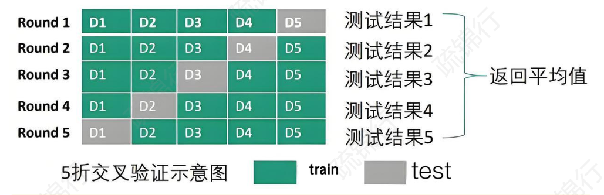
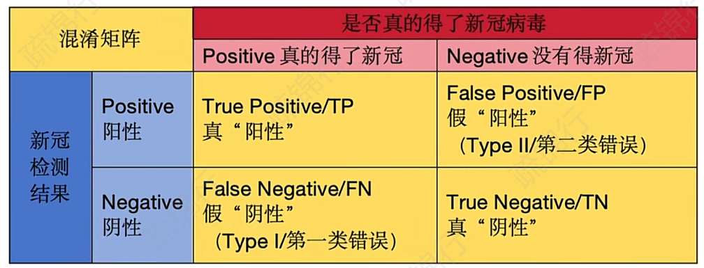
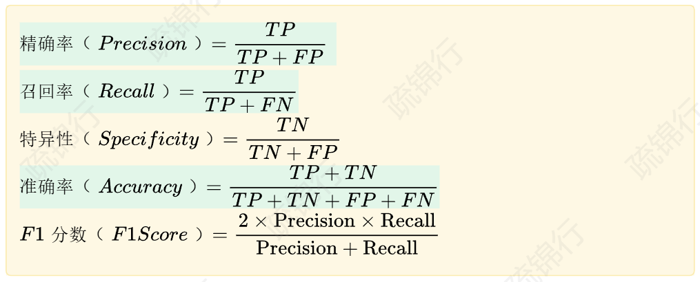

# 机器学习流程

数据获取

数据预处理

特征工程

训练集、验证集划分

# 数据预处理

## 不平衡标签处理

分类问题各类样本数量差大，则数据集不平衡，会导致最终模型偏向多数的那类。

使用**过采样处理**。

注意：

- **要在划分训练集和测试集之后**，在训练集中进行过采样，不然不就相当于改了考试题目。
- **要在标准化、特征选择之后过采样**，不然过采样产生的样本会影响均值等统计值，标准化会有问题。

### 1 随机过采样（ROS）

（Random Over Sampling）

随机复制样本来增多样本

优点：简单好用

缺点：可能导致过拟合

建议数据比较多的时候使用ROS或者一些混合方法

### 2 合成少数类过采样技术（SMOTE）

（Synthetic Minority Over - sampling Technique）

合成少数类样本。方法：在该样本k个最邻近的邻居中选择一个邻居样本，然后新样本为该样本与邻居样本连线上的随机一点。

优点：减少了过拟合的风险

缺点：计算复杂度比较高。如果k值选的不好，会引入噪声样本。

建议数据集比较小的时候选择SMOTE

## 缺失值处理

### 1 直接删除

用于随机缺失，用数据可视化的办法判断随机缺失。

### 2 填补法

- 均值：分布均匀，无明显异常值
- 中位数：偏态分布，有异常值干扰
- 众数：特征是类别

优点：计算简单

缺点：可能引入偏差

- 用模型预测填补（随机森林补全法，计算复杂，可能模型本身就有误差）

## 数据清洗

连续数据：画箱线图

离散数据：画直方图

但是大多数时候不会清洗异常值，因为不了解特征，异常值也能为模型带来泛化性。

## 离散特征编码

两类：

1. 定序特征（ordinal）：有明显顺序，小学-中学-大学
2. 名义特征（nominal）：只是类别不同

使用**onehot编码**能防止模型将名义变量视为定序变量。但是会大大增加存储的需求。

k个类别，只用k-1个二进制就可以表达。

## 连续特征处理

### 分箱（离散化）

将连续值划分为区间（如年龄分箱为 “0-18”“19-30” 等）。

优点：

1. 降低噪声
2. 对异常值不明显，提高鲁棒性
3. 能捕捉非线性关系（比如决策树）

### 归一化

将特征值放缩到一定范围，比如[0, 1]

### 标准化

将特征值转化为均值为0，标准差为1的分布，适用于数据服从正态分布（线性回归，SVM）

### 正态变换

通过对数变换将偏态分布转化为正态分布。如果本来是偏态分布，归一化和标准化后还是偏态分布。

优点：能压缩数据尺寸，方便线性模型拟合。

## 半监督学习

当缺乏数据的时候，使用一部分没有标签的特征去预测，得到预测的标签——伪标签，这个伪标签生成时有一个置信度，设置一个置信阈值，就可以将大于这个阈值的伪标签当成真实标签放入未来的训练中，这样起到了多一部分训练数据的作用。

# 描述性统计

几种统计：

- 分析单个特征
- 分析特征与特征之间的联合分布
- 相关性分析（相关系数矩阵）：通过热力图，可以判断特征是否存在高度重合（比如体感温度和真实温度）

为后续特征工程，选模型提供依据。

# 特征工程

## 筛除噪声

l1正则化，式子加在损失函数中。实现特征选择，将一些特征的系数缩小接近0。

## 常见的操作

- 借助相关性分析：重要的特征构造交互项
- 数据有周期：月份，使用sin
- 尝试a+b：无意义，为准确率服务

可以使用深度学习做自动化的特征工程

# 模型训练和预测

## 线性回归

## 逻辑回归

L1正则化：稀疏特征，特征选择。lasso，弹性网

L2正则化：防止过拟合。岭回归，弹性网

## 朴素贝叶斯模型

基于贝叶斯模型和特征独立性假设

## KNN（K 近邻）

给定一个训练数据集，对于新的输入实例，在训练数据集中找到与该实例最邻近的 K 个实例，然后根据这 K 个实例的类别或值来决定新实例的类别（取k个邻居中最多的）或值（取k个邻居的平均）。

## SVM（支持向量机）

在特征空间中找到一个最优的超平面，使得不同类别的样本能够被尽可能大的间隔分开，这些离超平面最近的样本点被称为支持向量。

若线性可分，就找到能够分类的那个间隔最大的超平面。

若线性不可分，就引入松弛变量，允许一些样本不满足原来的约束条件。

通过核技巧，可以将原始特征空间映射到高维空间，然后变得线性可分。

优点：高维空间表现好；泛化能力比较强

缺点：计算复杂；难调参

## 随机森林

属于集成学习的Bagging。有放回随机抽样在原始数据中随机抽子集，训练一棵决策树。然后最终结果投票/均值决定。

## XGBoost

属于集成学习的Boosting，是梯度提升树的升级，多了正则化来防止过拟合。

优点：防止过拟合，正确率高

缺点：参数多，调参难。

## 决策树

## LightGBM

为高维特征设计。

使用Boosting，迭代训练一系列决策树，逐步前一轮迭代的残差，结果累积起来形成一个强学习器。

在决策树分裂时将连续特征当成离散特征

优点：调参快，内存省

缺点：容易过拟合

## 集成学习

结合多个模型的预测结果，减少单个模型的偏差或者方差，提高整体的性能。

### 1 bagging

**思想：**并行训练多个模型，结果取平均值/众数

**模型：**随机森林，每棵树使用不同的随机样本的特征子集

**优点：**减少方差，防止过拟合

**缺点：**模型之间独立，无法修正错误

**场景：**样本比较少，特征关系简单，如随机森林

### 2 Boosting

**思想：**串行顺序训练多个模型，每个模型尝试修复前一个模型的错误

**模型：**AdaBoost，梯度提升树

**场景：高维特征空间，复杂的特征交互，极大的样本量**

### 3 stacking

**思想：**训练多个基模型，将预测结果作为输入，训练一个元模型。需要结构化数据。

**优点：**可以结合不同模型的优势

**缺点：**实现复杂，计算成本高

## MLP（全连接神经网络）

## DBSCAN

# 调参：避免过拟合且模型效果好

树模型过深容易导致过拟合

- **训练集**：用于训练模型，使模型学习数据中的模式与关系，以实现对新数据的预测。
- **验证集**：辅助模型选择与超参数调整，监控训练过程，防止模型在训练集上过拟合，支持早停策略或调整模型复杂度。
- **测试集**：模型训练完成后，用于评估模型的准确性与泛化能力，确保模型在未见过的新数据上表现良好。

## 网格搜索

对所有的参数统统试一遍。从单个参数开始，这样可以在较短时间内找到一个比较好的值。

能涨点。

## 贝叶斯优化

建立一个模型，先随机尝试几种参数的组合，然后用类似控制变量的方法观察参数的可能权重，再进行反复组合，最后得到一个比较满意的参数组合。

## optuna超参数调参

## 交叉验证

相比于（训练集、验证集、测试集）的模式，由于数据珍贵，可以交叉验证用（训练集，测试集），如下图

交叉验证涨不了点，且如上图需要5倍的时间，但是更准确了

## 二次调参

第一次调参：对多个模型，使用网格搜索遍历参数组合，用交叉验证的F1分数作为评估指标，找到每个模型自己最优的超参数，完成局部最优解。

阈值调整：对上面模型的最优的模型进行阈值调整，根据F1分数作为评估指标。

stacking：对所有的模型在训练集上训练，然后将输出作为一个简单的逻辑回归的输入，训练这个元模型

加权融合：手动调整所有模型预测结果的权重，通过元模型的的F1分数来进行优化。

# 评估指标

精确率：**关注误报**

召回率：**关注漏报**

F1分数：精确率与召回率的调和平均数，越高越好

## ROC和AUC

通过不断调整二分类中判断的阈值，每次阈值下，算两个值：

- **真阳性率（TPR）**：真垃圾邮件中，被模型正确判断为垃圾的比例（抓对真垃圾的能力）。纵轴。
- **假阳性率（FPR）**：正常邮件中，被模型误判为垃圾的比例（错怪正常邮件的程度）。横轴。

绘制出曲线，曲线与靠近左上角，模型越好。

**AUC（曲线下面积）：**AUC越接近1，模型就越有分辨能力，性能越好

## 其他指标

MSE：均方误差

RMSE：均方根误差

MAE：平均绝对误差

MAPE ：预测值与真实值之间误差的平均百分比

R^2^值：能够解释的因变量的变异比例

多重共线性：特征间的相关性。线性模型（线性回归，逻辑回归）一定要处理这个。树模型（XGBoost，随机森林）不用处理。

# 损失函数

回归问题：

- 均方误差/均方根误差

分类问题：

- 对数损失
- 交叉熵损失

对于神经网络而言：

训练损失下降，验证损失上升，则过拟合

损失都下降，则模型变好

# 可解释性分析

使用shap库分析

- 能发现模型的一些问题：是否有偏差
- 分析重要的特征，指导模型的改进

不用可解释性分析的场景：实时推荐交易（只在乎性能），黑箱模型已被广泛接收（cv，nlp），难以解释（自动化特征），娱乐场景（没必要）

只关心精度的话，直接pca降维，压缩特征个数到10个，这样每个新特征的含义就没人知道了，这样保留了很多信息

# 问题

### 特征工程和数据预处理的差别在于？

数据预处理：不改变特征的数量，只会修改特征的分布。最多过采样增加样本数量。

特征工程：会增加新特征或者筛去不重要的特征。

### 描述性统计和解释性统计

描述性统计是在建模前看看数据的分布。

解释性统计是在建模后针对模型看看哪个特征最有用处，这个往往是描述性统计第一时间看不出来的。

