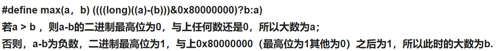
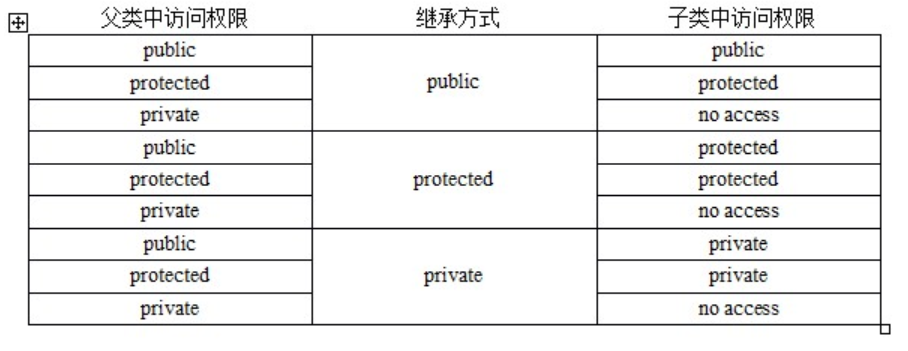
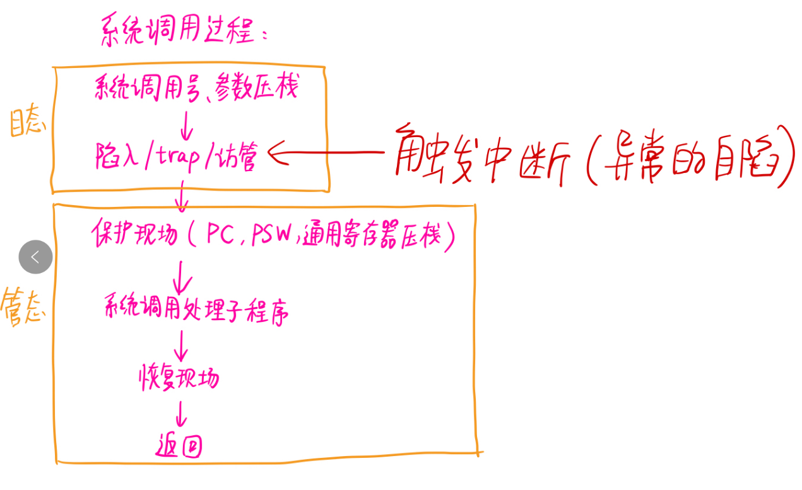
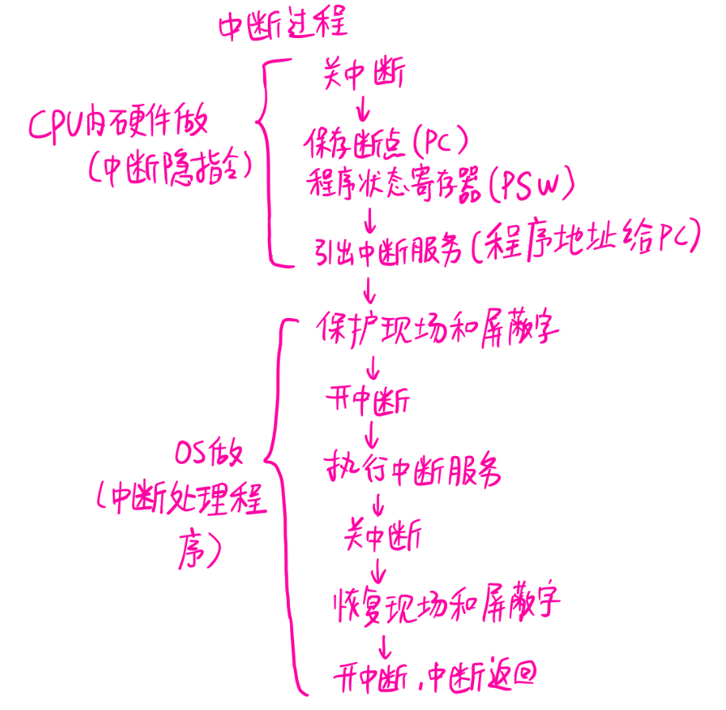

# 项目相关，介绍一个自己认为做的比较好的项目，其中的难点，针对项目内容进行了提问

# 问了下为什么会转嵌入式

之前我接触过 [之前相关领域，如 FPGA]，在这个过程中，我逐渐意识到嵌入式系统在更多实际场景中的广泛应用和巨大潜力。比如智能家居系统，通过嵌入式设备可以实现对家电的智能控制，让生活变得更加便捷和舒适；还有工业自动化领域，嵌入式系统能够提高生产效率和质量，降低人力成本。

我之前在 [之前相关领域，如 FPGA] 积累了一定的硬件设计和编程基础，而嵌入式开发与我之前的经验有很多相通之处，能够让我快速上手。

# static关键字

1. **修饰局部变量：**当 `static` 用于修饰局部变量时，该变量会存储在**静态存储区(.data段)**，而不是栈上。变量只会在程序**第一次执行到其声明处时进行初始化**，再次进入该函数时，保留上一次调用结束时的值
2. **修饰全局变量：**当 `static` 用于修饰全局变量时，该全局变量的**作用域被限制在定义它的源文件**内，其他源文件无法通过 `extern` 关键字来引用该变量。
3.  **修饰函数：**当 `static` 用于修饰函数时，该函数的**作用域被限制在定义它的源文件**内，其他源文件无法调用该函数。

**c++中：**

1. **静态成员变量：**在类中，`static` 修饰的成员变量属于类本身，而不是类的某个对象。**所有对象共享同一个静态成员变量，并且必须在类外进行初始化**。
2.  **静态成员函数：**在类中，`static` 修饰的成员函数属于类本身，而不是类的某个对象。静**态成员函数只能访问静态成员变量和其他静态成员函数**，不能访问非静态成员。

# 哈希表 哈希冲突

**哈希表时间复杂度为什么是O(1)?**	

数组在内存中是一块连续的地址空间，只要知道查找数据的下标就可以快速定位到数据的内存。那么哈希表就是利用了数组的这种特性，即**hash表的物理存储其实是数组**。

事实上，(“abc”,“hello”) 这样的 Key、Value 数据并不会直接存储在 Hash 表的数组中，因为数组要求存储固定数据类型，主要目的是每个数组元素中要存放固定长度的数据。所以，**数组中存储的是 Key、Value 数据元素的地址指针**。一旦发生 Hash 冲突，只需要将相同下标，不同 Key 的数据元素添加到这个链表就可以了。查找的时候再遍历这个链表，匹配正确的 Key。

**哈希冲突常见的解决方法：**

1. **开放寻址法（Open Addressing）**

- **线性探测（Linear Probing）**：当发生哈希冲突时，依次检查下一个存储位置，直到找到一个空槽。
- **二次探测（Quadratic Probing）**：当发生哈希冲突时，检查的位置按照二次函数的形式递增，例如 \(h(k, i) = (h'(k) + i^2) \mod m\)，其中 \(h'(k)\) 是原始哈希值，i 是探测次数，m 是哈希表的大小。
- **双重哈希（Double Hashing）**：使用两个哈希函数，当发生哈希冲突时，通过第二个哈希函数计算偏移量，依次检查相应的位置。

2. **链地址法（Chaining）**

   每个存储位置都对应一个链表或其他数据结构（如红黑树）。当发生哈希冲突时，将新的键值对插入到对应位置的链表或数据结构中。

# 链表


# 数组名和指针的区别

首先&arr应该是整个元素的地址，但是打印出来却是首元素的地址，不同之处在于对地址做加法运算后有不同，如下：

```c++
int arr[10]={0};
printf("%p\n",arr);//首元素的地址
printf("%p\n",arr+1);

printf("%p\n",&arr[0]);//首元素的地址
printf("%p\n",&arr[0]+1);

printf("%p\n",&arr);//整个数组元素的地址
printf("%p\n",&arr+1); 
```

**输出首元素地址都是相同的，arr+1和&arr[0]+1都是只移动了4个字节，但是&arr+1移动了40个字节**

**结论：&arr代表的是整个数组的地址，虽然它具体表现为首个元素的地址，但是在对其进行操作时，是以整个数组为单位的。**

arr 本身是左值（但不可仅凭此表达式修改），指代数组对象。不过 arr 会在大多数场合隐式转换成右值表达式 &(arr[0]) ，为指针类型，指向 arr[0] 。&arr 是右值表达式，为指针类型，指向 arr 本身。简单来说就是 arr 本身不是地址而是指代整个数组，只不过会隐式转成指针罢了。

# 指针与数组

其实就是数组的指针和指针的数组

数组的指针：指向一个数组的指针就是数组指针

指针的数组：一个数组的每一个元素都是指针

# sizeof

在编译时计算，因此sizeof不能用来返回动态分配的内存空间的大小。

数组——编译时分配的数组空间大小；

指针——存储该指针所用的空间大小（存储该指针的地址的长度，是长整型，应该为4）；

类型——该类型所占的空间大小；

对象——对象的实际占用空间大小；

函数——函数的返回类型所占的空间大小。函数的返回类型不能是void。

对了，还要注意结构体的内存对齐原则！！！这个也是考点

```c++
int a[10];
cout << sizeof(a) << endl;  // 40 = 10 * 4(int为4字节)
cout << sizeof(&a) << endl;  // 8 指针占8字节
cout << sizeof(&a[0]) << endl;  // 8 指针占8字节
```

```c++
sizeof(struct)是内存对齐后所有成员长度的加和。

sizeof(union)是最长的数据成员的长度。
```

**问：**定义一个不包含任何成员变量和成员函数的空的类，对该类型sizeof，得到的结果是多少？

**答：**1。用了一个char为了保证空类和空类之间在内存中不会有相同的地址。**c++中的struct和class本质其实没有区别，区别仅仅是默认的“权限不同”，class是private，struct是public，sizeof(class)或者sizeof(struct)是1。**

**问：**如果在空类里面添加一个构造函数和析构函数，sizeof是多少？

**答：**1。因为调用构造函数和析构函数或者其他函数只需要知道函数的地址就行，函数的地址和类的实例无关。

**问：**如果吧析构函数或者其他函数编程虚函数呢？

**答：**如果类中有虚函数，会生成虚函数表，并且每个对象都会在头部添加一个**指向虚函数表的指针**。所以sizeof就是**指针的大小**，计算机内部地址总线的宽度，32位机器上是4，64位机器上是8。

**问：**不用sizeof如何获得int所占的字节数？

**思路：**设初始值为1，则循环将值左移，直到值为0，记录循环的次数，即总共的位数，再除以8（一个字节=8位），即该类型的字节长度。

# 宏定义写一个比较大小

```c++
#define MAX(a, b) ({        \
        typeof(a) _a = a;   \
        typeof(b) _b = b;   \
        (void)(&_a == &_b); \
        _a > _b ? _a : _b;  \
    })
```

typeof在gun c上是可以支持的，它可以自动获取参数类型。

- 主要目的是触发一个编译器警告（如果 `a` 和 `b` 的类型不兼容）。`&_a == &_b` 是一个比较两个指针是否相等的表达式，由于 `_a` 和 `_b` 是不同的变量，它们的地址通常是不相等的，所以这个比较的结果通常为 `false`。
- `(void)` 用于将这个表达式的结果转换为 `void` 类型，以避免编译器产生关于未使用表达式结果的警告。

https://blog.csdn.net/u013053268/article/details/134031218

**定义一个宏，比较两个数a、b的大小，不能使用大于、小于、if语句**



# c与c++区别

C：面向过程。

C++：面向过程、面向对象和泛型编程。面向对象编程允许将数据和操作数据的函数封装在一起形成类，通过类的实例（对象）来实现程序的功能。泛型编程则提供了一种通用的编程方式，能够编写可复用的代码，不依赖于具体的数据类型。

- 类和对象：

  - C 语言：没有类和对象的概念，主要通过结构体（`struct`）来组织相关的数据，但结构体只能包含数据成员，不能包含成员函数。

  - C++ 语言：引入了类（`class`）的概念，类是一种用户自定义的数据类型，它可以包含数据成员和成员函数。类的实例称为对象，通过对象可以访问类的成员。

  - **c++类`class`中默认是`private继承、private访问权限`**

    **c++结构体`struct`中默认是`public继承、public访问权限`**

- 继承和多态：

  - C 语言：不支持继承和多态的特性。
  - C++ 语言：支持继承，允许一个类（派生类）继承另一个类（基类）的属性和方法。多态则允许使用基类的指针或引用来调用派生类的方法，实现运行时的动态绑定。

- 命名空间：

  - C 语言：没有命名空间的概念，容易出现命名冲突的问题。
  - C++ 语言：引入了命名空间（`namespace`），可以将全局作用域划分为不同的命名空间，避免命名冲突。

- 引用：
  - C 语言：没有引用的概念，主要使用指针来实现间接访问。
  - C++ 语言：引入了引用（`&`），引用是变量的别名，使用引用可以避免指针的一些复杂性。

# 介绍多态

多态主要分为编译时多态（静态多态）和运行时多态（动态多态）：

### **编译时多态（静态多态）**

- **原理**：编译时多态是在编译阶段就确定要调用的函数，主要通过函数重载和运算符重载来实现。
- **函数重载**：在同一个作用域内，可以定义多个同名函数，但它们的参数列表（参数个数、类型或顺序）不同。编译器会根据调用函数时提供的实参来选择合适的函数进行调用。
- **运算符重载**：允许为自定义类型重新定义运算符的行为，使得运算符可以用于自定义类型的对象。

### 运行时多态（动态多态）

- **原理**：运行时多态是在程序运行时才确定要调用的函数，主要通过继承和虚函数来实现。基类指针或引用可以指向派生类对象，当通过基类指针或引用调用虚函数时，会根据实际指向的对象类型来决定调用哪个类的虚函数。
- **虚函数**：在基类中使用 `virtual` 关键字声明的函数称为虚函数。派生类可以重写（override）基类的虚函数，以实现自己的功能。

### 作用

- **提高代码的可扩展性**：通过多态，我们可以在不修改现有代码的情况下，轻松地添加新的类和功能。例如，在上面的形状示例中，如果需要添加一个新的形状类（如三角形），只需要继承 `Shape` 类并重写 `draw` 函数即可。
- **增强代码的灵活性**：多态允许我们编写通用的代码，这些代码可以处理不同类型的对象。例如，我们可以编写一个函数，该函数接受一个 `Shape` 基类指针作为参数，然后根据实际指向的对象类型调用相应的 `draw` 函数。
- **实现代码的复用**：通过继承和多态，我们可以复用基类的代码，同时在派生类中实现自己的特定功能。

### 注意事项

- **虚函数的开销**：运行时多态使用虚函数表和虚函数指针来实现，这会带来一定的内存开销和运行时开销。
- **函数重写的规则**：在重写基类的虚函数时，需要注意函数的签名（返回类型、参数列表）必须与基类的虚函数一致，否则可能会导致意外的结果。

# 继承的优缺点

1. 单一继承：继承一个父类，这种继承称为单一继承，这也是我们用的做多的继承方式。
2. 多重继承：一个派生类继承多个基类，类与类之间要用逗号隔开，类名之前要有继承权限，假使两个或两个基类都有某变量或函数，在子类中调用时需要加**类名限定符**如obj.classA::i = 1；
3. 菱形继承：多重继承掺杂隔代继承1-n-1模式，此时需要用到虚继承，例如 B，C虚拟继承于A，D再多重继承B，C，否则会出错。后面有将具体虚继承怎么做。



### 优点

1. 代码复用

2. 提高可维护性

3. 建立类的层次结构：继承有助于建立清晰的类的层次结构，使得代码的组织更加合理。通过将类按照一定的层次关系进行划分，可以更好地反映现实世界中的事物关系，提高代码的可读性和可理解性。
3. **多态**

### 缺点

1. 增加耦合度：继承会使基类和派生类之间产生紧密的耦合关系。基类的修改可能会影响到所有派生类，甚至可能导致派生类无法正常工作。这种耦合度的增加会降低代码的灵活性和可扩展性。
2. 破坏封装性：在某些情况下，继承可能会破坏基类的封装性。**派生类可以访问基类的一些受保护成员，这可能会违反基类的设计初衷，使得基类的内部实现细节暴露给派生类。**
3. 继承层次过深导致复杂性增加

### 菱形继承产生的冲突问题

#### 1. 数据冗余问题

在上述菱形继承结构中，类 `D` 会从类 `B` 和类 `C` 分别继承一份基类 `A` 的成员。也就是说，类 `D` 对象内部会存在两份 `A` 类的数据成员，这就造成了数据冗余。在存储和内存使用方面会造成浪费，特别是当 `A` 类的数据成员较多或者占用空间较大时，这种浪费会更加明显。

#### 2. 二义性问题

由于类 `D` 中存在两份基类 `A` 的成员，当通过类 `D` 的对象访问基类 `A` 的成员时，编译器无法确定要访问哪一份，从而产生二义性问题。

### 解决菱形继承冲突问题的方法

#### 虚继承（Virtual Inheritance）

**虚继承**是解决菱形继承问题的有效方法。**通过在类 `B` 和类 `C` 继承基类 `A` 时使用 `virtual` 关键字，**使得类 `D` 只拥有一份基类 `A` 的成员，从而避免了数据冗余和二义性问题。

```c++
#include <iostream>

// 基类 A
class A {
public:
    int data;
    A() : data(10) {}
};

// 类 B 虚继承自 A
class B : virtual public A {};

// 类 C 虚继承自 A
class C : virtual public A {};

// 类 D 继承自 B 和 C
class D : public B, public C {};

int main() {
    D d;
    // 现在可以直接访问 data 成员，不会产生二义性
    d.data = 20; 
    std::cout << d.data << std::endl;
    return 0;
}
```

# define和inline区别

### 处理阶段

- **`#define`**：在**预处理阶段**进行处理。预处理器会对代码中的宏进行简单的文本替换，不进行任何语法检查。
- **`inline`**：在**编译阶段**进行处理。编译器会根据具体情况决定是否将函数以内联方式展开。如果编译器认为内联展开会带来性能提升，就会将函数代码嵌入到调用处；否则，会将其作为普通函数处理。

### 类型检查

- **`#define`**：**不进行类型检查**。宏只是简单的文本替换，不考虑替换内容的类型。
- **`inline`**：**进行严格的类型检查**。

### 作用域和生命周期

- **`#define`**：宏没有作用域的概念，一旦定义，**在整个文件中（直到使用 `#undef` 取消定义）或者在指定的包含范围内都有效**。
- **`inline`**：内联函数遵循普通函数的作用域规则，它的作用域取决于函数的定义位置。内联函数也有自己的生命周期，在程序运行过程中，函数的代码会被加载到内存中，当函数调用结束后，相关的栈帧会被销毁。

### 调试和可维护性

- **`#define`**：宏的**调试相对困难**，因为在预处理阶段宏已经被替换，调试器看到的是替换后的代码，而不是原始的宏定义。
- **`inline`**：内联函数的调试与普通函数类似，调试器可以正常显示函数的调用栈和局部变量。

### 代码膨胀问题

- **`#define`**：宏的使用可能会导致代码膨胀，尤其是宏定义中包含大量的代码或者宏被多次使用时。因为每次使用宏都会进行文本替换，会增加代码的体积。
- **`inline`**：内联函数也可能会导致代码膨胀，因为内联展开会将函数代码复制到调用处。但编译器会根据具体情况进行优化，只有在认为内联展开带来的性能提升大于代码膨胀的代价时，才会进行内联展开。

# 野指针、悬挂指针

野指针(wild pointer)指的是未经初始化的指针

悬挂指针(dangling pointer)指的是已经销毁的对象或已经回收的地址

#### 1. 指针未初始化

#### 2. 内存释放后指针未置空

当使用 `free`（C 语言）或 `delete`（C++）释放了指针所指向的内存后，如果没有将该指针置为 `NULL`（C 语言）或 `nullptr`（C++），那么这个指针就会变成野指针，因为它仍然指向那块已经被释放的内存。

#### 3. 指针越界访问

当指针超出了其合法的内存范围时，也会产生类似野指针的效果。例如，在访问数组时，如果指针越过了数组的边界，那么它就指向了一个不确定的内存地址。

### 避免方法

#### 1. 初始化指针

在定义指针变量时，尽量对其进行初始化。如果暂时不知道要指向哪里，可以将其初始化为 `NULL`（C 语言）或 `nullptr`（C++）。

#### 2. 释放内存后将指针置空

#### 3. 检查指针的有效性

在解引用指针之前，先检查指针是否为 `NULL` 或 `nullptr`，确保其指向的是有效内存。

#### 4. 避免指针越界访问

在使用指针访问数组等连续内存区域时，要确保指针不会超出合法的范围。可以通过控制循环条件等方式来避免越界。

# 栈溢出

#### 1. 递归调用过深

#### 2. 大量的局部变量

#### 3. 嵌套函数调用过多

### 如果在类的析构函数中调用delete this，会发生什么？

会导致堆栈溢出。原因很简单，delete的本质是“为将被释放的内存调用一个或多个析构函数，然后，释放内存”。显然，delete this会去调用本对象的析构函数，而析构函数中又调用delete this，形成无限递归，造成堆栈溢出，系统崩溃。

# wifi

WiFi 是一种允许电子设备连接到一个无线局域网（WLAN）的技术，通常使用 2.4G UHF 或 5G SHF ISM 射频频段。它基于 IEEE802.11 标准，通过无线接入点（AP）作为桥梁，让各种支持 WiFi 的设备能够相互通信并访问互联网。

### 工作原理

#### 信号发射与接收

- **发射**：无线设备（如无线路由器）中的射频电路会将**数字信号转换为高频的无线信号**，通过天线向周围空间发送。这些信号以电磁波的形式在空气中传播，就像广播电台发射的信号一样。
- **接收**：支持 WiFi 的设备（如手机、电脑等）配备了相应的无线网卡和天线，用于接收这些电磁波信号。无线网卡中的射频电路会将接收到的**无线信号转换回数字信号**，以便设备进行处理。

#### 频段与信道

- **频段**：WiFi 主要使用 2.4GHz 和 5GHz 两个频段。**2.4GHz 频段的信号传播距离较远，但传输速度相对较慢，且容易受到干扰；5GHz 频段的信号传输速度快，但传播距离相对较短，穿墙能力也较弱。**
- **信道**：每个频段又被划分为**多个信道**，例如 2.4GHz 频段通常有 13 个信道，5GHz 频段有更多的信道。不同的信道在频率上有所不同，设备可以通过选择不同的信道来避免与其他设备产生干扰，实现稳定的通信。

#### 调制与编码

- **调制**：为了在无线信号中传输数字数据，需要**对信号进行调制**。常见的调制方式有**正交频分复用（OFDM）**等。OFDM 将高速的数据流分成多个低速的子数据流，分别在不同的子载波上进行调制传输，这样可以提高频谱利用率，减少信号之间的干扰。
- **编码**：在调制之前，还需要对数字数据进行编码，以提高数据传输的可靠性和效率。例如，采用**卷积编码、Turbo 编码**等技术，对数据进行冗余处理，使得接收端能够在一定程度上纠正传输过程中出现的错误。

#### 通信协议与握手过程

- **协议**：WiFi 通信遵循 **IEEE802.11** 标准协议族，包括 802.11a、802.11b、802.11g、802.11n、802.11ac、802.11ax（Wi-Fi6）等。这些协议规定了 WiFi 的各种技术细节，如数据传输速率、调制编码方式、帧格式等。
- **握手过程**：当设备要连接到 WiFi 网络时，会进行一系列的握手过程。首先，设备会发送探测**请求帧**，搜索周围的 WiFi 网络；无线路由器收到请求后，会发送**探测响应帧**，包含网络的相关信息，如 SSID（网络名称）、支持的速率等。然后，设备根据这些信息选择要连接的网络，并发送**关联请求帧**；无线路由器验证设备的合法性后，发送**关联响应帧**，完成连接过程。之后，设备还需要进行身份验证和密钥协商，以确保网络通信的安全。

### 数据传输

- **数据帧格式**：在 WiFi 网络中，数据是以帧的形式进行传输的。帧包括报头、数据和校验字段等部分。报头包含了源地址、目的地址、帧类型等信息，用于指示数据的发送方、接收方和帧的功能；数据部分则是实际要传输的内容；校验字段用于检测数据在传输过程中是否出现错误。
- **介质访问控制（MAC）**：由于多个设备可能同时想要使用无线信道进行数据传输，为了避免冲突，WiFi 采用了**载波监听多路访问 / 冲突避免（CSMA/CA）**机制。设备在发送数据前，会先监听信道是否空闲，如果信道空闲，则等待一段随机时间后再发送数据；在发送数据的过程中，还会不断检测是否发生冲突，如果发生冲突，会立即停止发送，并等待一段更长的随机时间后重新尝试发送。

# Socket网络编程

- **Socket**：Socket（套接字）是网络编程中的一个抽象概念，它是网络通信的端点。在网络中，两台计算机之间的通信可以看作是两个 Socket 之间的通信。**每个 Socket 都有一个唯一的地址，由 IP 地址和端口号组成**，用于标识网络中的特定进程。

### 工作流程

#### 服务器端

1. **创建 Socket**：使用特定的函数创建一个 Socket 对象，指定通信协议（如 TCP 或 UDP）和地址族（如 IPv4 或 IPv6）。
2. **绑定地址**：将创建的 Socket 与一个特定的 IP 地址和端口号绑定，以便客户端能够找到该服务器。
3. **监听连接**：对于 TCP 协议，服务器需要开始监听客户端的连接请求。
4. **接受连接**：当有客户端发起连接请求时，服务器接受该连接，并返回一个新的 Socket 对象用于与客户端进行通信。
5. **数据传输**：通过新的 Socket 对象与客户端进行数据的发送和接收。
6. **关闭连接**：当通信结束后，关闭 Socket 连接。

#### 客户端

1. **创建 Socket**：同样使用特定的函数创建一个 Socket 对象。
2. **连接服务器**：指定服务器的 IP 地址和端口号，向服务器发起连接请求。
3. **数据传输**：连接成功后，与服务器进行数据的发送和接收。
4. **关闭连接**：通信结束后，关闭 Socket 连接。

```c++
// server
#include <iostream>
#include <cstring>
#include <sys/socket.h>
#include <arpa/inet.h>
#include <unistd.h>

#define PORT 8888

int main() {
    int server_fd, new_socket;
    struct sockaddr_in address;
    int opt = 1;
    int addrlen = sizeof(address);
    char buffer[1024] = {0};
    const char *response = "Hello from server!";

    // 创建套接字
    if ((server_fd = socket(AF_INET, SOCK_STREAM, 0)) == 0) {
        perror("socket failed");
        exit(EXIT_FAILURE);
    }

    // 设置套接字选项
    if (setsockopt(server_fd, SOL_SOCKET, SO_REUSEADDR | SO_REUSEPORT, &opt, sizeof(opt))) {
        perror("setsockopt");
        exit(EXIT_FAILURE);
    }
    address.sin_family = AF_INET;
    address.sin_addr.s_addr = INADDR_ANY;
    address.sin_port = htons(PORT);

    // 绑定地址和端口
    if (bind(server_fd, (struct sockaddr *)&address, sizeof(address)) < 0) {
        perror("bind failed");
        exit(EXIT_FAILURE);
    }
    // 监听连接
    if (listen(server_fd, 3) < 0) {
        perror("listen");
        exit(EXIT_FAILURE);
    }
    // 接受连接
    if ((new_socket = accept(server_fd, (struct sockaddr *)&address, (socklen_t*)&addrlen)) < 0) {
        perror("accept");
        exit(EXIT_FAILURE);
    }
    // 接收客户端消息
    int valread = read(new_socket, buffer, 1024);
    std::cout << "Client message: " << buffer << std::endl;
    // 发送响应给客户端
    send(new_socket, response, strlen(response), 0);
    std::cout << "Response sent to client" << std::endl;
    // 关闭套接字
    close(new_socket);
    close(server_fd);
    return 0;
}
```

```c++
// client
#include <iostream>
#include <cstring>
#include <sys/socket.h>
#include <arpa/inet.h>
#include <unistd.h>

#define PORT 8888

int main() {
    int sock = 0;
    struct sockaddr_in serv_addr;
    char *message = "Hello from client!";
    char buffer[1024] = {0};

    // 创建套接字
    if ((sock = socket(AF_INET, SOCK_STREAM, 0)) < 0) {
        perror("socket creation error");
        return -1;
    }
    serv_addr.sin_family = AF_INET;
    serv_addr.sin_port = htons(PORT);

    // 将 IPv4 地址从点分十进制转换为二进制形式
    if (inet_pton(AF_INET, "127.0.0.1", &serv_addr.sin_addr) <= 0) {
        perror("Invalid address/ Address not supported");
        return -1;
    }
    // 连接服务器
    if (connect(sock, (struct sockaddr *)&serv_addr, sizeof(serv_addr)) < 0) {
        perror("Connection Failed");
        return -1;
    }
    // 发送消息给服务器
    send(sock, message, strlen(message), 0);
    std::cout << "Message sent to server" << std::endl;
    // 接收服务器响应
    int valread = read(sock, buffer, 1024);
    std::cout << "Server response: " << buffer << std::endl;
    // 关闭套接字
    close(sock);
    return 0;
}
```

# tcp稳定性

#### 三次握手建立连接

- 客户端向服务器发送一个 SYN 包，包含客户端的初始序列号（ISN），表示请求建立连接。
- 服务器收到 SYN 包后，向客户端发送一个 SYN + ACK 包，包含服务器的初始序列号和对客户端 SYN 包的确认号，表示同意建立连接。
- 客户端收到 SYN + ACK 包后，向服务器发送一个 ACK 包，包含对服务器 SYN 包的确认号，表示连接建立成功。

#### 数据确认和重传机制

- 发送方将数据分割成多个数据包，并为每个数据包分配一个序列号。接收方收到数据包后，会向发送方发送一个确认包（ACK），确认号为下一个期望接收的数据包的序列号。
- 如果发送方在一定时间内没有收到某个数据包的确认信息，会认为该数据包丢失，会重新发送该数据包。

#### 滑动窗口流量控制

- 接收方通过在确认包中携带窗口大小信息，告知发送方自己当前的接收缓冲区剩余空间大小。发送方根据接收方的窗口大小，动态调整自己的发送窗口，控制发送数据的量。
- 发送窗口和接收窗口的大小会随着数据的发送和接收而动态变化，确保数据的传输不会超出接收方的处理能力。

#### 拥塞控制算法

- TCP 采用了多种拥塞控制算法，如慢启动、拥塞避免、快速重传和快速恢复等。
- 慢启动：在开始发送数据时，发送方的拥塞窗口（cwnd）初始值较小，每次收到确认信息后，拥塞窗口大小会加倍，直到达到慢启动阈值（ssthresh）。
- 拥塞避免：当拥塞窗口达到慢启动阈值后，发送方进入拥塞避免阶段，每次收到确认信息后，拥塞窗口大小只增加 1，避免网络拥塞。
- 快速重传和快速恢复：当发送方收到三个重复的确认信息时，会认为某个数据包丢失，立即重传该数据包，并调整拥塞窗口大小，进入快速恢复阶段。


TCP 是**面向连接的、可靠的、基于字节流**的传输层通信协议。

**面向连接**：一定是「一对一」才能连接，不能像 UDP 协议可以一个主机同时向多个主机发送消息，也就是一对多是无法做到的；

**可靠的**：无论的网络链路中出现了怎样的链路变化，TCP 都可以保证一个报文一定能够到达接收端；

**字节流**：(无边界+有序的概念)消息是「没有边界」的，所以无论我们消息有多大都可以进行传输。并且消息是「有序的」，当「前一个」消息没有收到的时候，即使它先收到了后面的字节，那么也不能扔给应用层去处理，同时对「重复」的报文会自动丢弃。

**所以有一个问题比如：有一个 IP 的服务器监听了一个端口，它的 TCP 的最大连接数是多少？**

首先服务器端地址确定了，源端口确定了，那么只有客户端的IP数和目标端口不确定，那不就是$2 ^ {32} \times 2^{16} = 2^{48}$。当然实际上并发的TCP连接数肯定达不到这么多：①**文件描述符限制**，Socket 都是文件，所以首先要通过 `ulimit` 配置文件描述符的数目；②**内存限制**，每个 TCP 连接都要占用一定内存，操作系统的内存是有限的。

# udp协议如何变可靠，方法

如果用UDP实现TCP功能，需要实现以下事情：

1. 增加**ack机制**，确保能发送到对端
2. 增加**seq机制**，实现顺序化传输
3. **需要用队列实现缓冲区，主要是为了重传**
4. **校验**机制

**问：多说一嘴，为啥现在很多都自己实现TCP协议？**

答：因为慢启动和拥塞避免的缺点。

**问：在哪一层进行封装？**

答：在应用层。下一层的功能要用上一层来进行封装。

# 浏览器输入url之后的全过程，涉及的相关协议

### 1. DNS 解析

- **过程**：浏览器首先需要将输入的域名转换为对应的 IP 地址，因为计算机网络通信是基于 IP 地址进行的。浏览器会按照以下顺序查找域名对应的 IP 地址：
  - **浏览器缓存**：浏览器会先检查自身的缓存，看是否已经有该域名对应的 IP 地址记录。如果有且未过期，直接使用该 IP 地址。
  - **系统缓存**：如果浏览器缓存中没有找到，会检查操作系统的缓存，如 Windows 系统的 `hosts` 文件或 DNS 缓存服务。
  - **本地 DNS 服务器**：若系统缓存中也没有，浏览器会向本地 DNS 服务器发送 DNS 查询请求。本地 DNS 服务器通常由网络服务提供商（ISP）提供。
  - **根 DNS 服务器**：如果本地 DNS 服务器没有该域名的记录，它会向根 DNS 服务器发送查询请求。根 DNS 服务器会返回顶级域名服务器（如 `.com`、`.org` 等）的地址。
  - **顶级域名服务器**：本地 DNS 服务器再向顶级域名服务器发送查询请求，顶级域名服务器会返回权威 DNS 服务器的地址。
  - **权威 DNS 服务器**：最后，本地 DNS 服务器向权威 DNS 服务器发送查询请求，权威 DNS 服务器会返回该域名对应的 IP 地址。
- **涉及协议**：DNS（Domain Name System）协议，使用 UDP 或 TCP 进行通信。通常查询请求使用 UDP 协议，因为 UDP 开销小、速度快；当查询结果超过 512 字节时，会使用 TCP 协议进行传输。

### 2. TCP 连接建立

- **过程**：浏览器得到域名对应的 IP 地址后，会根据 URL 中的端口号（默认 HTTP 端口为 80，HTTPS 端口为 443），通过 TCP 协议与服务器建立连接。TCP 连接建立采用三次握手机制：
  - **客户端发送 SYN 包**：客户端向服务器发送一个 SYN 包，包含客户端的初始序列号（ISN），表示请求建立连接。
  - **服务器发送 SYN + ACK 包**：服务器收到 SYN 包后，向客户端发送一个 SYN + ACK 包，包含服务器的初始序列号和对客户端 SYN 包的确认号，表示同意建立连接。
  - **客户端发送 ACK 包**：客户端收到 SYN + ACK 包后，向服务器发送一个 ACK 包，包含对服务器 SYN 包的确认号，表示连接建立成功。
- **涉及协议**：TCP（Transmission Control Protocol）协议，是一种面向连接的、可靠的传输层协议，确保数据在传输过程中不会丢失、重复或乱序。

### 3. HTTP 请求发送

- **过程**：TCP 连接建立成功后，浏览器会根据 URL 构造 HTTP 请求消息，并通过 TCP 连接发送给服务器。HTTP 请求消息包括请求行、请求头和请求体三部分。请求行包含请求方法（如 GET、POST 等）、请求的资源路径和 HTTP 版本；请求头包含一些额外的信息，如用户代理、接受的内容类型等；请求体通常用于 POST 请求中，包含要提交的数据。
- **涉及协议**：HTTP（Hypertext Transfer Protocol）或 HTTPS（HTTP Secure）协议。HTTP 是一种明文传输协议，而 HTTPS 是在 HTTP 基础上加入了 SSL/TLS 加密协议，保证数据传输的安全性。

### 4. 服务器处理请求

- **过程**：服务器接收到浏览器发送的 HTTP 请求后，会根据请求的内容进行相应的处理。服务器可能会查询数据库、调用后端程序等，以生成响应数据。
- **涉及协议**：服务器端使用的协议取决于具体的应用场景和服务器架构，可能涉及数据库协议（如 MySQL 协议）、应用程序协议（如 CGI、FastCGI 等）。

### 5. HTTP 响应返回

- **过程**：服务器处理完请求后，会构造 HTTP 响应消息，并通过 TCP 连接返回给浏览器。HTTP 响应消息包括状态行、响应头和响应体三部分。状态行包含 HTTP 版本、状态码（如 200 表示成功，404 表示未找到资源等）和状态描述；响应头包含一些额外的信息，如响应内容的类型、长度等；响应体包含服务器返回的实际数据，如 HTML 页面、图片等。
- **涉及协议**：同样是 HTTP 或 HTTPS 协议。

### 6. 浏览器解析渲染页面

- **过程**：浏览器接收到服务器返回的 HTTP 响应后，会根据响应内容进行解析和渲染。具体步骤如下：
  - **解析 HTML**：浏览器会解析 HTML 文档，构建 DOM（Document Object Model）树。
  - **解析 CSS**：解析 CSS 样式表，构建 CSSOM（CSS Object Model）树。
  - **合并渲染树**：将 DOM 树和 CSSOM 树合并成渲染树，确定每个元素的样式和布局。
  - **布局计算**：根据渲染树进行布局计算，确定每个元素在页面中的位置和大小。
  - **绘制页面**：最后，浏览器根据布局信息将页面绘制到屏幕上。
- **涉及协议**：在解析和渲染过程中，浏览器可能会根据 HTML 中的链接请求其他资源，如图片、脚本等，这些请求同样使用 HTTP 或 HTTPS 协议。

### 7. TCP 连接关闭

- **过程**：页面渲染完成后，浏览器会根据 HTTP 协议的配置（如Connection头字段的值）决定是否关闭 TCP 连接。如果Connection头字段的值为close，则浏览器和服务器会通过四次挥手机制关闭 TCP 连接：
  - **客户端发送 FIN 包**：客户端向服务器发送一个 FIN 包，表示请求关闭连接。
  - **服务器发送 ACK 包**：服务器收到 FIN 包后，向客户端发送一个 ACK 包，表示同意关闭连接。
  - **服务器发送 FIN 包**：服务器处理完剩余的数据后，向客户端发送一个 FIN 包，表示自己也准备关闭连接。
  - **客户端发送 ACK 包**：客户端收到 FIN 包后，向服务器发送一个 ACK 包，表示同意关闭连接。
- **涉及协议**：TCP 协议。

# 用户态和内核态？追问了系统调用的过程（没说全，提示了内核态系统调用结束后会发生什么）



## **系统调用结束后会进行进程调度！！！**



# 编译过程

### 预处理（Preprocessing）

- **作用**：预处理是编译的第一个阶段，主要处理源代码中的预处理指令，如 `#include`、`#define`、`#ifdef` 等。预处理指令以 `#` 开头，用于在编译之前对源代码进行文本替换、文件包含、条件编译等操作。

### 编译（Compilation）

- **作用**：编译阶段将预处理后的源代码翻译成汇编语言代码。编译器会对源代码进行词法分析、语法分析、语义分析等操作，检查代码的语法和语义错误，并生成中间表示形式，最终转换为汇编代码。

### 汇编（Assembly）

- **作用**：汇编阶段将汇编语言代码转换为机器语言代码，生成目标文件。汇编器会将汇编指令翻译成对应的机器指令，并生成二进制形式的目标文件。

### 链接（Linking）

- **作用**：链接阶段将多个目标文件和库文件组合成一个可执行文件。在一个程序中，可能会包含多个源文件，每个源文件会被编译成一个目标文件，同时还可能会使用到系统库或第三方库。链接器的任务就是将这些目标文件和库文件中的代码和数据进行合并，解决符号引用问题，生成一个完整的可执行文件。

# linux多线程，保证线程安全的方法

### 1. 互斥锁（Mutex）

### 2. 读写锁（Read-Write Lock）

- **原理**：读写锁允许多个线程同时进行读操作，但在进行写操作时，会独占资源，不允许其他线程进行读或写操作。这种机制适用于读操作频繁，写操作较少的场景，可以提高并发性能。

### 3. 信号量（Semaphore）

### 4. 原子操作

### 5. 线程局部存储（Thread-Local Storage, TLS）

- **原理**：线程局部存储允许每个线程拥有自己独立的变量副本，不同线程对该变量的访问不会相互影响，从而避免了线程间的竞争问题。

# 介绍线程池优缺点

### 主要组成部分

线程池主要由以下几个部分组成：

- **线程池管理器**：负责线程池的创建、销毁、线程数量的调整等管理工作。它是线程池的核心控制部分，决定了线程池的整体行为和性能。
- **工作线程**：线程池中的线程，它们是实际执行任务的单元。工作线程会不断地从任务队列中获取任务并执行，执行完一个任务后，会继续等待下一个任务。
- **任务队列**：用于存储待执行的任务。当有新的任务提交到线程池时，如果线程池中的工作线程都在忙碌，任务就会被放入任务队列中等待执行。任务队列通常采用先进先出（FIFO）的原则，但也可以根据具体需求实现其他的排序规则。
- **任务接口**：定义了任务的基本结构和执行方法。所有提交到线程池的任务都需要实现这个接口，以便线程池能够统一管理和执行这些任务。

### 工作流程

#### 1. 线程池的初始化

- 当创建线程池时，线程池管理器会根据配置参数创建一定数量的工作线程，并将它们放入线程池中。这些线程在创建后会处于等待状态，等待任务的到来。
- 同时，线程池会初始化任务队列，用于存储待执行的任务。

#### 2. 任务提交

- 当有新的任务需要执行时，调用者会将任务提交给线程池。任务通常需要实现线程池规定的任务接口，包含任务的具体逻辑和执行方法。
- 线程池会根据当前的状态和配置，决定如何处理这个任务。具体处理方式如下：

#### 3. 任务分配

- **线程有空闲**：如果线程池中存在空闲的工作线程，线程池会立即从线程池中选择一个空闲线程，并将任务分配给该线程执行。被选中的线程会从等待状态变为运行状态，开始执行任务。

- **线程无空闲但任务队列未满**：如果线程池中的所有工作线程都在忙碌，且任务队列还没有达到最大容量，线程池会将任务放入任务队列中等待执行。工作线程在执行完当前任务后，会从任务队列中取出一个任务继续执行。

- 线程无空闲且任务队列已满

  ：如果线程池中的所有工作线程都在忙碌，并且任务队列已经达到最大容量，线程池会根据预先设置的拒绝策略来处理这个任务。常见的拒绝策略有以下几种：

  - **AbortPolicy（默认策略）**：直接抛出 `RejectedExecutionException` 异常，拒绝新任务的提交。
  - **CallerRunsPolicy**：由调用线程来执行这个任务。也就是说，提交任务的线程会亲自执行该任务，而不是将任务交给线程池中的工作线程。
  - **DiscardPolicy**：直接丢弃这个任务，不做任何处理。
  - **DiscardOldestPolicy**：丢弃任务队列中最老的任务，然后将新任务放入任务队列中。

#### 4. 任务执行

- 工作线程从任务队列中获取任务后，会调用任务的执行方法，开始执行任务。在执行过程中，工作线程会占用 CPU 资源，执行任务的具体逻辑。
- 任务执行完成后，工作线程会释放占用的资源，并将自己的状态从运行状态变为空闲状态，然后继续从任务队列中获取新的任务。

#### 5. 线程池的关闭

- 当线程池不再需要使用时，需要进行关闭操作。关闭线程池时，线程池管理器会停止接受新的任务，并等待所有正在执行的任务完成。
- 可以选择立即关闭线程池，此时线程池会尝试中断正在执行的任务，并清空任务队列；也可以选择优雅地关闭线程池，等待所有任务执行完毕后再关闭线程池。

### 优点

#### 1. 提高性能

- **减少线程创建和销毁开销**：线程的创建和销毁是比较消耗系统资源的操作。在传统的多线程编程中，每处理一个任务就需要创建一个新线程，任务完成后再销毁该线程。而线程池中的线程是预先创建好的，当有任务到来时，直接从线程池中获取一个空闲线程来执行任务，任务完成后线程不会销毁，而是返回线程池等待下一个任务。这样可以显著减少线程创建和销毁带来的时间和资源开销，提高系统的响应速度和处理效率。
- **提高 CPU 利用率**：线程池可以根据系统的负载情况和硬件资源，合理地调整线程的数量。当有大量任务需要处理时，线程池可以充分利用多核 CPU 的优势，让多个线程并行执行任务，提高 CPU 的利用率。同时，线程池还可以避免创建过多的线程导致系统资源耗尽，从而保证系统的稳定性和性能。

#### 2. 便于管理

- **控制并发线程数量**：线程池可以限制并发线程的数量，避免因创建过多线程而导致系统资源耗尽。通过设置线程池的最大线程数，可以确保系统在高并发情况下仍然能够稳定运行，防止系统因线程过多而出现卡顿甚至崩溃的情况。
- **统一管理线程生命周期**：线程池负责管理线程的生命周期，包括线程的创建、调度和销毁。开发人员不需要手动管理每个线程的生命周期，减少了编程的复杂度和出错的可能性。同时，线程池还可以提供一些监控和管理功能，如统计线程的执行时间、任务队列的长度等，方便开发人员对系统进行优化和调优。

#### 3. 提高响应速度

- **快速响应任务**：由于线程池中的线程是预先创建好的，当有任务到来时，可以立即从线程池中获取一个空闲线程来执行任务，无需等待线程的创建过程。这样可以大大缩短任务的响应时间，提高系统的实时性和用户体验。

### 缺点

#### 1. 增加系统复杂性

- **线程池管理逻辑复杂**：线程池的实现涉及到线程的创建、调度、销毁以及任务队列的管理等多个方面，其内部逻辑比较复杂。开发人员需要深入理解线程池的工作原理和参数设置，才能正确地使用线程池。如果线程池的参数设置不合理，可能会导致系统性能下降或出现死锁等问题。
- **调试困难**：由于线程池中的线程是并发执行的，当出现问题时，调试会变得比较困难。线程之间的交互和竞争条件可能会导致一些难以复现的错误，增加了调试的时间和难度。

#### 2. 可能出现资源耗尽问题

- **任务队列过长**：如果任务提交的速度过快，超过了线程池的处理能力，任务队列可能会变得过长。这会导致任务在队列中等待的时间过长，影响系统的响应速度。同时，任务队列过长还会占用大量的内存资源，可能会导致系统内存耗尽。
- **线程池资源耗尽**：如果线程池中的线程数量设置不合理，或者任务的执行时间过长，可能会导致线程池中的所有线程都处于忙碌状态，无法处理新的任务。此时，新提交的任务只能在队列中等待，直到有线程空闲出来。如果这种情况持续时间过长，可能会导致系统资源耗尽，影响系统的正常运行。

#### 3. 不适合所有场景

- **短时间任务**：对于一些执行时间非常短的任务，使用线程池可能会带来额外的开销。因为线程池的管理和调度也需要一定的时间和资源，对于短时间任务来说，这些开销可能会超过任务本身的执行时间，从而降低系统的性能。
- **任务依赖关系复杂**：如果任务之间存在复杂的依赖关系，线程池的管理会变得更加困难。线程池通常是按照任务的提交顺序依次执行任务，对于有依赖关系的任务，可能需要额外的同步机制来保证任务的正确执行，这会增加编程的复杂度和系统的开销。

# 6万多球迷，如何按照年龄排序

综合考虑，对于大规模随机数据，快速排序通常是最快的选择，但为了避免最坏情况的发生，可以采用随机化快速排序。如果对空间没有严格限制，归并排序是一个稳定且高效的选择。

对于存储球迷年龄数据，使用数组是最简单和高效的数据结构。数组可以提供随机访问的能力，方便排序算法进行元素的比较和交换操作。

# 20个球，有个劣质的质量和其他球不一样，给个天平，最小次数找出劣质球

每次使用天平称重会产生三种可能结果（左边重、右边重、两边相等），每一次称重所获得的信息量可以帮助我们判断劣质球的位置。因此，要充分利用每次称重的结果，让每次称重都能最大程度地缩小劣质球的可能范围。

# 一个01数组，再给个k，代表k次能够将0变为1，求k次翻转后最大连续1的数量

1. **初始化滑动窗口**：使用两个指针 `left` 和 `right` 来表示滑动窗口的左右边界，初始时都指向数组的第一个元素。同时，使用一个变量 `zero_count` 来记录窗口内 0 的数量。
2. **移动右指针**：不断向右移动 `right` 指针，扩大窗口范围。如果遇到 0，则将 `zero_count` 加 1。
3. **调整左指针**：当 `zero_count` 超过 `k` 时，说明当前窗口内的 0 的数量超过了允许翻转的次数，此时需要缩小窗口。将 `left` 指针向右移动，如果 `left` 指针指向的元素是 0，则将 `zero_count` 减 1。
4. **更新最大长度**：在每次移动 `right` 指针后，计算当前窗口的长度（即 `right - left + 1`），并更新最大连续 1 的长度。

# i2c时序

### 基本概念

I2C 是一种多主多从的串行通信总线，这意味着总线上可以有多个主设备和多个从设备。主设备负责发起通信，控制时钟信号；从设备则响应主设备的请求。每个连接到 I2C 总线上的设备都有一个唯一的 7 位或 10 位地址，主设备通过地址来选择与之通信的从设备。

### 物理层

- **引脚**：I2C 总线只使用两条线进行通信，分别是串行数据线（SDA）和串行时钟线（SCL）。这两条线都需要接上拉电阻到电源，以确保在空闲状态下为高电平。
- **电气特性**：I2C 采用开漏输出结构，这种结构允许总线上的多个设备共享 SDA 和 SCL 线，并且可以避免多个设备同时驱动总线时产生的冲突。当某个设备要发送低电平时，它会将对应的线拉低；要发送高电平时，则释放该线，由上拉电阻将其拉高。

### 协议层

#### 1. 起始和停止条件

- **起始条件（START）**：当 SCL 线为高电平时，SDA 线由高电平向低电平跳变，标志着一次通信的开始。主设备通过产生起始条件来启动一次 I2C 通信，通知总线上的所有从设备准备接收数据。
- **停止条件（STOP）**：当 SCL 线为高电平时，SDA 线由低电平向高电平跳变，标志着一次通信的结束。主设备通过产生停止条件来终止当前的 I2C 通信，释放总线。

#### 2. 数据传输

- **数据有效性**：在 SCL 线为高电平期间，SDA 线上的数据必须保持稳定，此时数据被认为是有效的。只有在 SCL 线为低电平期间，SDA 线上的数据才允许发生变化。
- **字节传输**：I2C 通信以字节为单位进行传输，每个字节包含 8 位数据。数据传输时，先传输最高位（MSB），最后传输最低位（LSB）。主设备在每个 SCL 时钟脉冲的上升沿将数据发送到 SDA 线上，从设备在每个 SCL 时钟脉冲的下降沿读取 SDA 线上的数据。

#### 3. 应答机制

- 在每个字节传输完成后，接收方需要在第 9 个时钟周期发送一个应答位。
- 如果接收方成功接收到数据，会将 SDA 线拉低，表示应答（ACK）。
- 如果接收方无法接收数据（例如，没有更多的存储空间），会将 SDA 线保持高电平，表示非应答（NACK）。

#### 4. 通信模式

- **主发送模式**：主设备向从设备发送数据。主设备先发送从设备的地址和写操作标志（0），等待从设备应答后，再依次发送数据字节。
- **主接收模式**：主设备从从设备接收数据。主设备先发送从设备的地址和读操作标志（1），等待从设备应答后，从设备开始发送数据字节，主设备在每个字节接收后发送应答信号，最后一个字节接收后发送非应答信号。

### 优缺点

#### 优点

- **简单易用**：只需要两条线（SDA 和 SCL）就可以实现多个设备之间的通信，硬件连接简单，降低了系统的复杂度和成本。
- **多主多从结构**：支持多个主设备和多个从设备同时连接到总线上，方便系统的扩展和升级。
- **应答机制**：通过应答机制可以确保数据传输的可靠性，接收方可以及时反馈数据接收情况。

#### 缺点

- **传输速率相对较低**：I2C 的标准传输速率为 100 kbps，快速模式下可达 400 kbps，高速模式下可达 3.4 Mbps，相比一些其他高速通信协议（如 SPI），传输速率较低。
- **传输距离有限**：由于上拉电阻和线路电容的影响，I2C 总线的传输距离通常较短，一般在几米以内。

### 应用场景

- **传感器连接**：许多传感器（如温度传感器、湿度传感器、加速度计等）都支持 I2C 接口，通过 I2C 总线可以方便地将传感器与微控制器连接起来，实现数据的采集和传输。
- **EEPROM 读写**：EEPROM 是一种可擦除可编程的只读存储器，常用于存储系统的配置信息和数据。通过 I2C 总线可以方便地对 EEPROM 进行读写操作。
- **显示设备控制**：一些小型的显示设备（如 OLED 显示屏、LCD 显示屏等）也支持 I2C 接口，通过 I2C 总线可以向显示设备发送控制命令和显示数据。

# 软件模拟i2cspi使用

# 像操作系统FreeRTOS用到哪些硬件资源呢

### 处理器资源

- CPU 核心
  - FreeRTOS 的任务调度、中断处理等核心功能都需要 CPU 来执行。不同架构的 CPU 都可以运行 FreeRTOS，如 ARM Cortex - M 系列、AVR、PIC 等。
  - CPU 的性能（如主频、指令集等）会影响 FreeRTOS 的运行效率。例如，较高主频的 CPU 可以更快地完成任务调度和上下文切换，从而提高系统的实时响应能力。
- 寄存器
  - 用于保存任务的上下文信息，包括程序计数器（PC）、堆栈指针（SP）、通用寄存器等。在任务切换时，FreeRTOS 会将当前任务的寄存器值保存到任务堆栈中，并恢复下一个要执行任务的寄存器值。

### 存储器资源

- RAM（随机存取存储器）
  - **任务堆栈**：每个任务都需要有自己独立的堆栈空间，用于保存任务的局部变量、函数调用信息等。任务堆栈的大小需要根据任务的复杂度和需求进行合理配置，否则可能会导致堆栈溢出。
  - **内核数据结构**：FreeRTOS 内核需要使用一定的 RAM 空间来存储任务控制块（TCB）、队列、信号量等数据结构。这些数据结构用于管理任务、同步和通信。
- ROM/Flash（只读存储器 / 闪存）
  - 用于存储 FreeRTOS 内核代码、应用程序代码和常量数据。由于这些数据在系统运行过程中不需要修改，因此可以存储在非易失性的 ROM 或 Flash 中。

### 中断控制器

- FreeRTOS 需要借助中断控制器来处理外部中断和内部异常。当中断发生时，中断控制器会将控制权交给相应的中断服务程序（ISR）。
- 在中断服务程序中，FreeRTOS 可以进行任务通知、信号量释放等操作，以实现任务间的同步和通信。同时，FreeRTOS 还提供了中断嵌套管理机制，确保高优先级的中断能够及时得到处理。

### 定时器

- **系统滴答定时器**：FreeRTOS 使用系统滴答定时器来提供系统时钟节拍，用于任务调度和时间管理。系统滴答定时器按照固定的时间间隔产生中断，FreeRTOS 根据这个时钟节拍来进行任务的延时、超时判断等操作。
- **硬件定时器**：除了系统滴答定时器外，还可以使用其他硬件定时器来实现特定的功能，如定时任务、PWM 输出等。

### 通信接口

- **UART（通用异步收发传输器）**：常用于调试信息输出和与外部设备进行通信。在开发和调试过程中，可以通过 UART 将 FreeRTOS 的日志信息、任务状态等输出到终端设备，方便开发者进行调试和监控。
- **SPI（串行外设接口）、I2C（集成电路总线）**：用于连接各种外部设备，如传感器、存储器、显示屏等。FreeRTOS 可以通过这些接口与外部设备进行数据交换，实现数据采集、设备控制等功能。

### 其他资源

- **GPIO（通用输入输出接口）**：可以用于控制外部设备的开关、读取传感器的状态等。在 FreeRTOS 中，可以通过创建任务来实现对 GPIO 引脚的操作。
- **ADC（模拟 - 数字转换器）和 DAC（数字 - 模拟转换器）**：如果系统需要处理模拟信号，如采集传感器的模拟数据或输出模拟控制信号，就需要使用 ADC 和 DAC。FreeRTOS 可以通过任务来实现对 ADC 和 DAC 的控制和数据处理。

# FreeRTOS任务底层调度逻辑

### 基本概念

- **任务**：在 FreeRTOS 中，任务是程序执行的基本单元，每个任务都有自己独立的执行上下文，包括堆栈、寄存器值等。任务可以处于运行、就绪、阻塞、挂起等不同状态。
- **优先级**：每个任务都被分配一个优先级，范围从 0（最低优先级）到 configMAX_PRIORITIES - 1（最高优先级）。调度器会优先选择优先级高的任务运行。
- **时间片**：对于相同优先级的任务，FreeRTOS 支持时间片轮转调度，即每个任务在一个时间片内运行，时间片用完后，调度器会切换到下一个相同优先级的任务。

### 任务状态

FreeRTOS 中的任务有以下几种状态：

- **运行态**：当前正在使用 CPU 执行的任务处于运行态。在单 CPU 系统中，任何时刻只有一个任务处于运行态。
- **就绪态**：任务已经准备好运行，但由于更高优先级的任务正在运行，该任务暂时不能执行，处于就绪态。
- **阻塞态**：任务因等待某个事件（如延时、信号量、消息队列等）而暂停执行，处于阻塞态。当等待的事件发生时，任务会从阻塞态转换为就绪态。
- **挂起态**：任务被明确挂起，不再参与调度，直到被恢复。

### 调度算法

FreeRTOS 支持两种基本的调度算法：抢占式调度和时间片轮转调度。

#### 抢占式调度

- **原理**：当一个高优先级的任务进入就绪态时，调度器会立即暂停当前正在运行的低优先级任务，将 CPU 控制权交给高优先级任务，这种方式保证了高优先级任务能够及时得到执行，满足实时系统的要求。
- **实现**：调度器会在每个时钟节拍中断或任务状态发生变化时检查所有任务的优先级，选择优先级最高的就绪任务运行。

#### 时间片轮转调度

- **原理**：对于相同优先级的任务，调度器会为每个任务分配一个固定的时间片。当一个任务的时间片用完后，调度器会将 CPU 控制权切换到下一个相同优先级的就绪任务，实现任务的轮流执行。
- **实现**：系统滴答定时器会在每个时钟节拍中断时递减当前运行任务的时间片计数器，当计数器减为 0 时，调度器会进行任务切换。

### 底层调度逻辑流程

#### 1. 系统初始化

- 初始化任务控制块（TCB）：每个任务都有一个对应的 TCB，用于保存任务的状态、优先级、堆栈指针等信息。
- 初始化就绪列表：将所有就绪任务按照优先级插入到不同的就绪列表中，每个优先级对应一个就绪列表。
- 初始化系统滴答定时器：设置系统滴答定时器的周期，用于提供系统时钟节拍。

#### 2. 任务创建

- 当创建一个新任务时，分配一个新的 TCB 和堆栈空间，并将任务的初始状态设置为就绪态。
- 将新任务插入到相应优先级的就绪列表中。

#### 3. 任务调度

- **时钟节拍中断**：系统滴答定时器每隔一个固定的时间产生一次中断，在中断服务程序中，调度器会执行以下操作：
  - 递减当前运行任务的时间片计数器。
  - 检查是否有任务的阻塞时间到期，如果有，将这些任务从阻塞态转换为就绪态，并插入到相应的就绪列表中。
  - 如果当前任务的时间片用完或者有更高优先级的任务进入就绪态，调度器会触发任务切换。
- **任务状态变化**：当任务的状态发生变化（如调用延时函数、获取信号量等）时，调度器会根据新的状态更新任务的就绪列表，并可能触发任务切换。

#### 4. 任务切换

- **保存上下文**：在任务切换时，首先将当前运行任务的上下文（包括寄存器值、堆栈指针等）保存到任务的堆栈中。
- **选择下一个任务**：调度器从所有就绪任务中选择优先级最高的任务，如果有多个相同优先级的任务，则按照时间片轮转的方式选择。
- **恢复上下文**：将下一个要运行任务的上下文从其堆栈中恢复到寄存器中，然后跳转到该任务的入口地址继续执行。

# FreeRTOS什么时候会出现意外

### 系统资源相关

#### 1. 内存不足

- **堆栈溢出**：每个任务都有自己的堆栈空间，如果任务在执行过程中使用的堆栈空间超过了预先分配的大小，就会发生堆栈溢出。这可能是由于任务中存在递归调用过深、局部变量占用空间过大等原因导致的。堆栈溢出会破坏其他任务或内核数据结构，导致系统崩溃或出现不可预期的行为。
- **动态内存耗尽**：FreeRTOS 支持动态内存分配（如`pvPortMalloc`和`vPortFree`），如果频繁地进行内存分配和释放操作，或者分配的内存块没有及时释放，可能会导致系统的动态内存耗尽。当再次请求内存分配时，会返回`NULL`，从而使相关功能无法正常工作。

#### 2. 时钟节拍问题

- **系统滴答定时器故障**：系统滴答定时器为 FreeRTOS 提供时钟节拍，用于任务调度和时间管理。如果定时器出现故障，如定时器配置错误、时钟源不稳定等，会导致时钟节拍不准确，进而影响任务的调度和延时功能。例如，任务可能无法按时唤醒或超时，导致系统的实时性无法保证。

### 任务管理相关

#### 1. 任务优先级设置不合理

- **优先级反转**：当低优先级任务持有高优先级任务所需的资源（如互斥信号量）时，高优先级任务会被阻塞，而此时中优先级任务可以抢占低优先级任务的 CPU 资源，导致高优先级任务的执行被延迟，出现优先级反转现象。这可能会破坏系统的实时性，甚至导致系统出现错误。
- **任务饿死**：如果某个任务的优先级设置过高，并且该任务长时间占用 CPU 资源，其他低优先级任务可能会因为无法获得 CPU 时间而长时间得不到执行，出现任务饿死的情况。

#### 2. 任务死锁

- **互斥信号量使用不当**：在使用互斥信号量保护共享资源时，如果任务获取信号量和释放信号量的顺序不一致，或者在持有信号量的过程中发生异常，可能会导致死锁。例如，任务 A 持有信号量 S1 并请求信号量 S2，而任务 B 持有信号量 S2 并请求信号量 S1，此时两个任务都会陷入无限等待，导致系统死锁。

### 中断处理相关

#### 1. 中断嵌套过深

- FreeRTOS 支持中断嵌套，但如果中断嵌套层数过多，会导致系统栈空间被大量占用，可能会引发堆栈溢出。此外，中断嵌套过深还会增加中断响应时间和系统的复杂度，降低系统的稳定性。

#### 2. 中断服务程序（ISR）编写不当

- **执行时间过长**：中断服务程序应该尽量短小精悍，快速完成中断处理任务。如果 ISR 执行时间过长，会影响系统的实时性，并且可能会导致其他中断被屏蔽的时间过长，错过重要的事件。
- **访问共享资源未同步**：如果 ISR 和任务之间访问共享资源，需要进行适当的同步操作（如使用中断安全的信号量）。否则，可能会导致数据不一致或系统崩溃。

### 硬件相关

#### 1. 硬件故障

- **芯片损坏**：如果嵌入式系统中的微控制器芯片出现硬件故障，如引脚短路、内部电路损坏等，会导致 FreeRTOS 无法正常运行。
- **外设故障**：与 FreeRTOS 系统连接的外设（如传感器、通信模块等）出现故障，可能会导致数据传输错误或任务无法正常执行。例如，串口通信模块出现故障，会导致数据收发异常。

#### 2. 电磁干扰

- 在复杂的电磁环境中，系统可能会受到电磁干扰，导致硬件信号不稳定。这可能会引起定时器中断丢失、数据传输错误等问题，影响 FreeRTOS 的正常运行。

### 外部因素相关

#### 1. 电源问题

- **电源波动**：不稳定的电源供应可能会导致系统复位或数据丢失。例如，电源电压突然下降，可能会使微控制器进入异常状态，影响 FreeRTOS 的运行。

#### 2. 软件兼容性问题

- 如果 FreeRTOS 与其他软件组件（如驱动程序、库函数等）存在兼容性问题，可能会导致系统出现意外。例如，驱动程序的版本不兼容，可能会导致外设无法正常工作。

# 用过的外设出过什么问题印象最深刻


# 反问：

平时团队工作的节奏是比较快还是比较慢的？

您觉得我还需要提升哪方面的专业技能？

晋升路线大概是什么样的？晋升条件是什么？

入职之后需要有哪些培训？