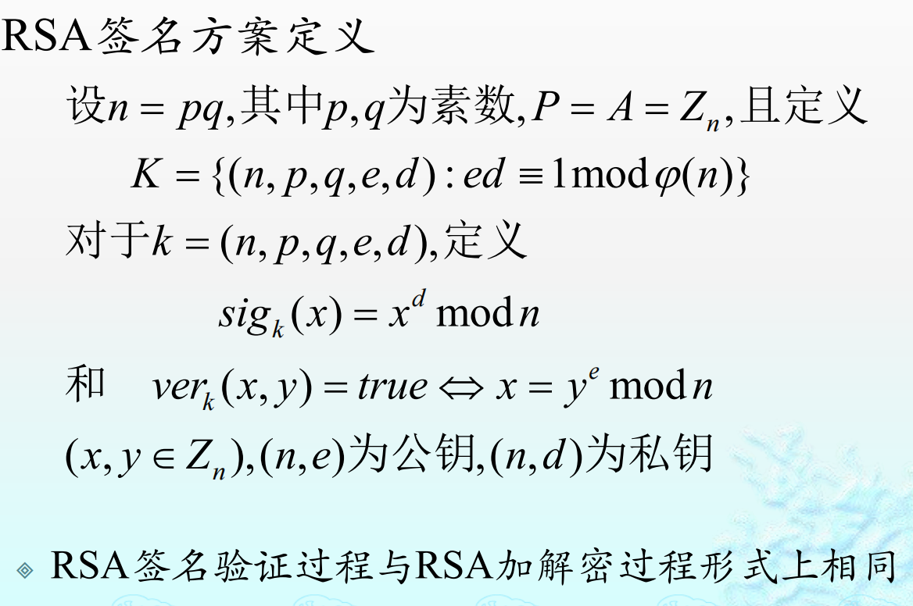

# 密码学

- 机密性
- 完整性
- 认证
- 不可否认：数字签名

现代密码学安全基于密钥

古典密码安全基于加密方法的保密

# 密码体制的安全性

可证明安全性：用归约到数学难题的方法来证明安全性

计算安全性：包含语义安全性

# 密文攻击方法

唯密文攻击：最难，密文够长就能分析大多古典密码

已知明文攻击

选择明文攻击

选择密文攻击

# 古典密码——基于加密方法的保密

主要用 **代换** 和 **置换**

加密函数必须是单射函数

都是**幂等密码**

- 凯撒密码（移位密码）

- 代换密码：

  - 每个字母有对应的密文字母
  - 能被词频分析

- 仿射密码：

  - ax+b mod 26
  - 能被词频分析

- 维吉尼亚密码：

  - 可以看作流密码的特殊情况
  - 密文分为一个个固定长度的组，每组和同一个的密钥字相加取模
  - 测试密钥字长度，出现重复的结构则可确定密钥字长度
  - 计算重合指数，找到最接近正常文字的重合指数的密钥字长度

- 希尔密码：

  - 乘一个矩阵
  - 唯密文难攻击，需要一些明密文对

- 置换密码：

  

# 流密码（序列密码）

使用和明文一样长的密钥加密

关键是如何生成这个密钥，他需要是个伪随机串

则安全性依赖于这个伪随机串产生装置

可以使用线性递推关系由初始向量开始产生伪随机序列，可以使用硬件实现：

他也存在周期，有最大周期为m序列，m序列0个数与1个数相等或1多一个，他是同步流密码（存在周期，密钥纯由初始向量生成）

另有异步流密码：密钥产生与明文和密文都相关

我国有ZUC祖冲之流密码

# 分组密码

手段：**代换S盒** 和 **置换P盒**

基本安全需求：**混乱**（明密文以及密钥关系复杂）和 **扩散**（单个密钥位或明文位能影响更多密文位）

结构：

- **SPN：**结构简单，高效快速	
- **Feistel：**加解密算法一样，除了白化（与轮密钥异或）的位置可能变了一下，且其中的函数这样就不用可逆了

乘积密码：两种密码体制复合

幂等密码：同一密码复合过后没有改变。若密码不是幂等的，可以通过**迭代**来加强安全性

## 线性密码分析（已知明文攻击）

分析代换S盒的线性特性：经过S盒会产生偏差（与0.5的差，不随机）

为已知明文攻击，需要较多的明密文对，只能分析最后一轮子密钥

## 差分密码分析（选择明文攻击）

基于S盒不均匀，有差分特征

构造若干明文串对，每对明文的异或相等，观察相应的密文异或结果

为选择明文攻击，需要较多的明密文对，只能分析最后一轮子密钥

## DES

Feistel结构，加密和解密算法相同，只是密钥编排方案不同

增强安全性：由于DES不是幂等的，可以DES * DES迭代来增强安全性

## AES（DES的进化版，比三重DES强）

## SM4

## 工作模式

### 电子密码本(ECB)

优点：简单

缺点：不安全

### 密码分组链接(CBC)

优点：分组之间相互影响，安全性好于ECB

缺点：不可并行；需要共同的初始化向量IV；存在错误传播现象

### 密码反馈(CFB)

将分组密码算法用于异步序列密码，数据可以在比分组小得多的单元里进行加密

优点：适于实时加密

缺点：不可并行；需要共同的初始化向量IV；存在错误传播现象

### 输出反馈(OFB)

将分组密码算法用于同步序列密码的方式

优点：不会传播错误

缺点：不可并行；需要共同的初始化向量IV、

### 计数器模式(CTR)

优点：可并行；加密数据块可随机访问；简单；安全

缺点：密钥只能用一次

### 密文挪用

密文挪用是一种在分组密码加密中处理短块的技术，通过将倒数第二组的密文用于最后一组的明文处理，无需填充即可保持密文与原文件大小一致，常用于透明加密系统以避免文件大小变化。

# 哈希函数

- 快速
- 单向（不可逆）
- 防碰撞

用于消息摘要和数字签名

## MD5

## SHA-1

## SHA-3（使用了海绵结构）

## SHA-256

## SHA-512

## SM3

# MAC（报文鉴别码）

带了某些安全性质的带**密钥**的**哈希**

- 通过不带密钥的Hash函数构造：HMAC
- 通过对称密码算法：CBC-MAC

## HMAC（基于哈希的消息认证码）

### 一、定义与核心目标

**HMAC**（Hash-based Message Authentication Code）是一种通过**密钥与哈希函数结合**生成消息认证码的技术，用于验证数据的**完整性**和**真实性**。其核心目标是确保消息在传输过程中未被篡改，且来源可靠。

### 二、核心组件

1. **密钥（Key）**
   - 对称密钥，长度通常与哈希函数输出长度一致（如 SHA-256 使用 256 位密钥）。
   - 密钥必须保密，且每次使用需独立生成（避免重复使用）。
2. **哈希函数（Hash Function）**
   - 常用算法：SHA-1、SHA-256、SHA-512、MD5（不推荐，因存在安全漏洞）。
   - 要求：抗碰撞性、雪崩效应、不可逆性。
3. **填充（Padding）**
   - 当密钥长度小于哈希函数块大小时（如 SHA-256 块大小为 512 位），通过填充（如 PKCS#7）扩展密钥长度。

### 三、工作原理

HMAC 的计算分为以下步骤：

1. **密钥处理**
   - 若密钥长度超过哈希函数块大小，先对密钥进行哈希压缩。
   - 若密钥过短，填充至块大小。
2. **生成两个临时密钥**
   - **Inner Key**：密钥与固定值（`0x36`重复填充）异或。
   - **Outer Key**：密钥与固定值（`0x5C`重复填充）异或。
3. **组合消息与密钥**
   - 将 Inner Key 与消息拼接，计算哈希值（H1）。
   - 将 Outer Key 与 H1 拼接，再次计算哈希值（H2），即最终 HMAC 值。

**数学表达式**：$ \text{HMAC}(K, M) = H[(K \oplus \text{outer\_pad}) \mathbin\| H[(K \oplus \text{inner\_pad}) \mathbin\| M]] $其中：

- K 为密钥，M 为消息；
- $\oplus $为异或操作，$\mathbin\|$为拼接操作。

### 四、安全性分析

1. **抗篡改能力**
   - 任何对消息的修改会导致 HMAC 值变化，接收方验证失败。
2. **抗伪造性**
   - 攻击者若无密钥，无法生成有效的 HMAC。
3. **抗长度扩展攻击**
   - 传统哈希函数（如 SHA-1）易受长度扩展攻击，但 HMAC 通过密钥约束避免此问题。
4. **密钥管理**
   - 密钥需安全存储，避免泄露。建议使用随机生成的高强度密钥（如 256 位）。

### 五、典型应用场景

1. **数据完整性验证**
   - 网络传输中附加 HMAC 值，接收方重新计算并比对。
2. **API 签名**
   - 客户端与服务器通过 HMAC 验证请求合法性（如 AWS API 签名 v4）。
3. **安全协议中的认证**
   - **IPsec**：在 ESP 协议中使用 HMAC 验证数据包完整性。
   - **TLS**：通过 HMAC 计算记录层的 MAC 值。
4. **密钥交换**
   - 在 IKEv2 协议中，HMAC 用于验证身份和协商参数。
5. **密码存储**
   - 结合盐值（Salt）存储 HMAC 后的密码哈希（如 PBKDF2 算法）。

## 加盐哈希

### **一、**定义与核心目标

**加盐（Salt）** 是密码学中用于增强哈希函数安全性的随机数据。其核心目标是通过为每个密码添加唯一的随机值，**防止预计算攻击（如彩虹表）**，并确保相同的密码在不同系统中生成不同的哈希结果。

### 二、工作原理

1. **盐的生成**
   - 使用加密安全的随机数生成器（CSPRNG）生成固定长度的随机字符串（如 16 字节）。
   - 盐值必须**不可预测**且**唯一**，通常每个密码对应一个盐。
2. **盐与密码的结合**
   - 将盐与密码明文拼接后再进行哈希运算，例如： $\text{Hash} = \text{HMAC}(K, \text{salt} \mathbin\| \text{password}) $（或使用 PBKDF2、BCrypt 等算法）。
3. **存储方式**
   - 将盐与哈希结果一起存储（如数据库中），验证时需同时读取盐值和哈希值。

### 三、加盐的必要性

1. **防御彩虹表攻击**
   - 彩虹表是预先计算的常见密码哈希对照表。加盐后，相同密码的哈希结果因盐不同而不同，彩虹表失效。
2. **防止字典攻击**
   - 攻击者无法批量验证哈希值，必须为每个盐重新计算哈希。
3. **增强密码空间**
   - 盐值相当于增加了密码的有效长度。例如，16 字节的盐使有效密码长度增加 128 位。

## 彩虹表

彩虹表是一种预计算的哈希值数据库，通过存储常见密码的哈希值及其对应明文，利用空间换取时间的策略，显著提高暴力破解加密密码的效率，尤其适用于无盐哈希的情况。

时间换空间，用加盐可以抵御

# 对称加密

**定义**：使用**同一个密钥**进行加密和解密的技术。

**典型算法**：

- AES（高级加密标准）
- DES/3DES

**优点**：

1. **速度快**：适合加密大量数据（如文件、网络传输）。
2. **资源消耗低**：对计算性能要求较低。

**缺点**：

1. **密钥管理复杂**：通信双方需安全共享密钥，易被中间人窃取。
2. **无法验证身份**：无法确认发送方或接收方的身份真实性。

**应用场景**：

- 数据存储加密（如硬盘加密）。
- 网络通信加密（如 VPN、HTTPS 中的数据传输阶段）。
- 加密文件传输（如加密压缩包）。

# **非对称加密**

**定义**：使用**一对密钥**（公钥和私钥），公钥公开，私钥保密。

**原理**：

1. **加密**：发送方用接收方的公钥加密数据。
2. **解密**：接收方用自己的私钥解密数据。
3. **签名验证**：发送方用私钥签名，接收方用公钥验证签名真实性。

**典型算法**：

- RSA
- ECC（椭圆曲线加密）
- Diffie-Hellman

**优点**：

1. **密钥交换安全**：无需传输私钥，解决对称加密的密钥分发问题。
2. **身份验证**：可通过数字签名确认发送方身份。

**缺点**：

1. **速度慢**：加密和解密计算量较大，不适合加密大量数据。
2. **密钥长度要求高**：需足够长度保证安全性（如 RSA 通常需 2048 位以上）。

**应用场景**：

- 密钥交换（如 HTTPS 握手阶段协商对称密钥）。		
- 数字签名（如软件代码签名、电子文档认证）。
- 身份验证（如 SSH 远程登录）。

# RSA

实现：

- 参数：素性检测
- 加解密：平方乘，蒙哥马利算法，中国剩余定理，扩展欧几里得求逆

共模攻击：是针对 RSA 加密的一种攻击方式，当两个不同公钥使用相同模数但不同指数时，攻击者可利用贝祖定理通过数学关系恢复明文。

- 问题1：群组内成员，即使不分解*n*，也可解密其他人消息
- 问题2：群组外人员如果截获到发送给群组不同成员的同一消息，而两个加密指数互素，则可直接恢复消息

Wiener 攻击是针对 RSA 加密的一种密码分析方法，当私钥解密指数 d 过小时（通常 d <n¹⁄⁴），攻击者利用连分数展开法从公钥 (e, n) 中快速恢复私钥 d，揭示密钥生成不当时的安全隐患。

# 离散对数

## Diffie-Hellman

中间人攻击：

## ElGamal密码体制

归约到离散对数问题

# 椭圆曲线

## SM2

## 椭圆曲线离散对数

# 数字签名

**不可抵赖**

与所签名的文件绑定，不能被伪造，容易验证

## RSA签名

## ElGamal签名方案

## SM2签名方案

# 安全协议

## PGP（Pretty Good Privacy）

**定义**：PGP 是一种基于公钥加密技术的安全通信协议，主要用于加密电子邮件、文件传输和数据存储，确保数据的机密性、完整性和不可否认性。

**核心技术**：

1. **混合加密机制：**
   - **对称加密**：使用 AES、CAST-128 等高效算法加密数据。
   - **非对称加密**：通过 RSA 或 ElGamal 交换对称密钥，降低密钥管理复杂度。
2. **数字签名**：基于公钥技术验证消息来源，防止篡改。
3. **密钥管理：**
   - 用户生成自己的公钥 / 私钥对，公钥可公开传播。
   - 采用 “信任网络（Web of Trust）”：通过第三方签名验证公钥的真实性。

**应用场景**：

- 加密敏感邮件（如隐私保护、商业机密传递）。
- 文件加密与数字签名（如开源项目发布时的校验）。

**示例**：用户 A 用用户 B 的公钥加密邮件内容，并用自己的私钥签名；用户 B 用私钥解密邮件，并通过 A 的公钥验证签名。

## SSL/TLS（Secure Sockets Layer/Transport Layer Security）

**定义**：SSL 及其继任者 TLS 是互联网通信的安全协议，用于在客户端（如浏览器）和服务器之间建立加密通道，保障数据传输安全。

**核心技术**：

1. **握手协议：**
   - **密钥交换**：支持 RSA、Diffie-Hellman 等算法生成共享密钥。
   - **身份验证**：通过数字证书（由 CA 签发）验证服务器身份。
2. **数据加密**：使用 AES、ChaCha20 等对称算法加密传输数据。
3. **完整性校验**：通过 HMAC 确保数据未被篡改。

**工作流程**（以 HTTPS 为例）：

1. 客户端请求服务器建立安全连接。
2. 服务器发送数字证书，客户端验证证书有效性。
3. 双方协商加密算法和密钥，完成握手。
4. 后续通信通过加密通道进行。

**应用场景**：

- 保护 Web 通信（HTTPS）、即时通讯（如 WhatsApp）、VPN 等。

**示例**：访问 `https://www.example.com` 时，浏览器与服务器通过 TLS 握手建立加密通道，防止中间人攻击。

| **特性**     | **PGP**                  | **SSL/TLS**                 |
| ------------ | ------------------------ | --------------------------- |
| **应用层**   | 应用层（邮件、文件）     | 传输层与应用层之间          |
| **密钥管理** | 信任网络（用户自主签名） | CA 证书链（中心化信任）     |
| **加密范围** | 单条消息或文件           | 整个通信会话（如 TCP 连接） |
| **典型场景** | 个人通信、文件加密       | 网站、即时通讯、API 安全    |

# IBE（基于身份加密）

- 以**任意身份信息作为公钥**
- 与传统公钥加密相比
  - IBE的公钥可以是具有唯一标识用户作用的自然信息或者自然属性
  - 以RSA为例，RSA的公钥是随机生成的与用户具有的自然属性没有关系
- 存在的问题
  - 邮件应用中的KGC为例，**KGC知道所有人的私钥**
  - 解决思路
    - IBE+传统公钥加密：加密时需同时使用ID和传统公钥，但无需PKI
    - “不经意”的IBE私钥生成技术

# ABE（基于属性加密）为了安全数据共享

**传统访问控制存在的问题：**

- 数据库数据以明文形式存放，通过验证用户权限实现数据访问，其安全性完全依赖用户对服务器安全性的信任
- 若数据库服务器存在漏洞，导致攻击者获得管理员权限，则该攻击者可以绕开访问控制策略获得数据
- 若数据库管理员本身与攻击者合谋，同样可以导致访问控制策略失效
- 传统的访问控制方法无法保证云计算环境下的数据安全性
  - 数据集中的云平台更容易成为攻击目标
  - 云平台缺乏可信性

基于属性加密：

- 实现了**加密与访问控制**的融合
- 相比于传统访问控制，无需可信第三方实现访问控制过程
- **CP-ABE：**以**访问控制策略做公钥**，以用户属性生成私钥
- **KP-ABE：**以属性做公钥，以**用户的访问控制策略生成私钥**
- ABE适用于企业级加密云存储与共享

# PRE（代理重加密）

- PRE以用户为中心，实现了用户**自主可控的访问控制**过程
- PRE的公钥类型与传统公钥体制或IBE一致，因此从工业的角度来说，更容易应用到现有密码系统中

# SSE（可搜索对称加密）

可搜索对称加密

- 研究较多，性能高，安全性相对较高
- 单一发送方和单一接收方场景

# PEKS（可搜索公钥加密）

可搜索公钥加密

- 研究相对较少，性能较低，安全性相对较低
- 多发送方和单一接收方场景

# HE（同态加密）

**HE的能力**

- 所有明文对服务器是保密的
- 在单一用户和多发送方场景，若函数是服务器私有的，接收者也不能获得该函数
- 在多发送方场景，接收者只能得到最后的结果，无法获知发送方密文对应的明文信息

密文同态性是实现密文计算的关键。

支持在密文上进行运算操作的加密算法被称为**同态加密**。

同态加密被广泛应用到许多应用之中，例如：

- 安全云计算
- 密文检索
- 机器学习的隐私保护
- 安全多方计算
- 零知识证明
- 私有信息抽取

# PQC（后量子密码）